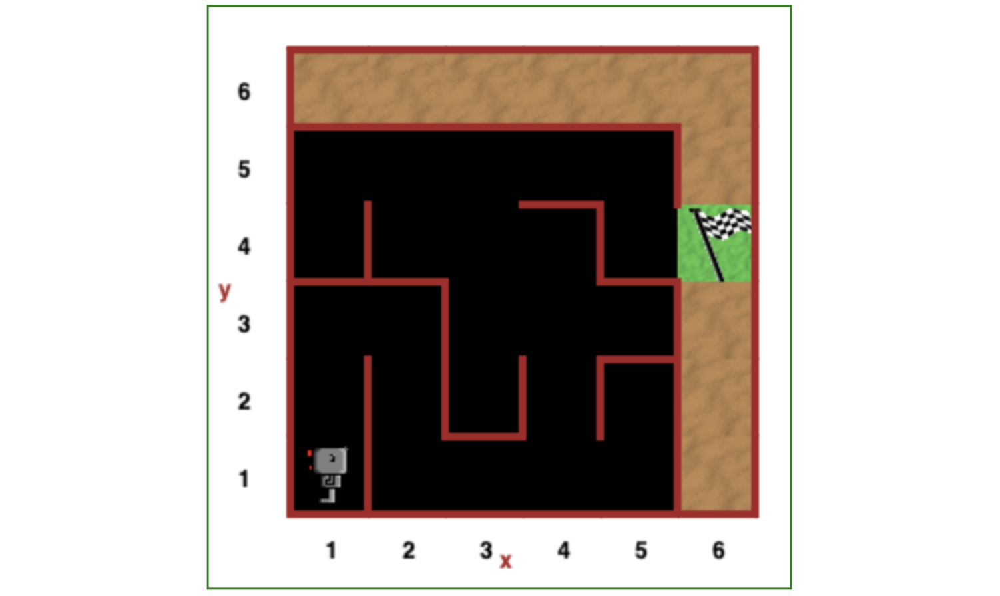

# Robot-In-A-Maze

Testing python code that guides a robot out of a maze.

## Introduction

This is a small documentation of testing a python code that helps a robot through a maze.

It's one of the execises in ["100 Days Of Code"](https://www.udemy.com/course/100-days-of-code/) Udemy course offered by Dr. Angela Yu.

The exercise was to help Reeborg the robot manoeuvre from a random point in a 5x5 grid maze to a designated exit (indicated by a flag in the figure below).

In addition to the random starting position, Reeborg starts of facing any of the four possible directions:

- Left
- Right
- Downwards
- Upwards

The two main objectives in writing this code were:

- To make Reeborg take decisive moves, choose and make progress in some path.
- To ensure Reeborg does not enter an infinite loop and get stuck, especially in corners.

The basic strategy is to be biased towards turning to the right instead of the left.

Of course, given the design restrictions of the possible manoeuvres Reeborg can make (such as _turn right_ has to be executed with three _left turns_,) brings some inefficiencies to the code.

## Testing objectives

Other than checking that the code does what it is meant to do, the aim was to,

- Assess the efficacy of the code.
- Testing for any bugs.

No doubt one could have automated the testing, but my insane obsession in testing this code is inexplicable.

After struggling with coming up with a functional code for hours, the excitement of winning was unstoppable.

Although the maze is not complicated, the number of possible paths are too many to do a case by case analysis. But I did it.

The obsessive testing paid off in the discovery of one minor bug.

## Testing results

Since it was necessary to test how Reeborg fares through the maze, starting from any point in the 5x5 grid, the results are listed according to each point in the grid.

These are further categorised according to whether Reeborg chose a direct path or not.

## Conclusion

Since my code is different from Dr Yu's solution, the problematic infinite loop that Reeborg experiences with Dr Yu's code does not exist.

I introduced some randomness in turning, especially at points with three walls all round, to ensure that Reeborg can _turn around_ instead of toggling between _turn left_ and _turn right_.

The discovered bug can be solved by enabling Reeborg to determine whether he has reached the destiny or not. (It doesn't make sense though how this oddity occurs because the main while loop ends on the very condition that the destiny has been reached.)

The idea of using the robot in a maze scenario is the most ingenous teaching aid to reinforce the use and understanding of functions in coding. A hat off to Dr Yu!

See the results according to the starting positions in the [outline doc](./Various-starting-point/outline-section.md).
