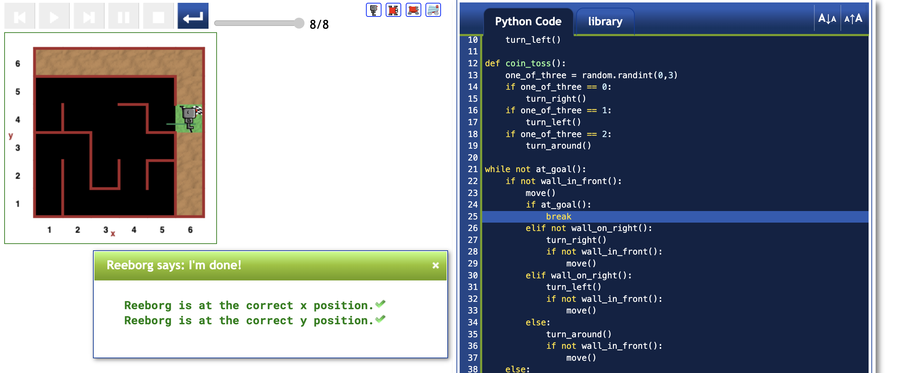

# Fixing the minor bug

Since the bug occurs due to a lack of the `at_goal()` check, the solution is to simply add an `if at_goal():` followed by a `break`.

That is, the while loop with new lines 24 and 25 is as follows:

```
while not at_goal():
    if not wall_in_front():
        move()
        if at_goal():
            break
        elif not wall_on_right():
            turn_right()
            if not wall_in_front():
                move()
        elif wall_on_right():
            turn_left()
            if not wall_in_front():
                move()
        else:
            turn_around()
            if not wall_in_front():
                move()
    else:
        if not wall_on_right():
            turn_right()
            move()
        else:
            turn_left()
            if not wall_in_front():
                move()
            else:
                coin_toss()
```

See the figure below for the evidence of the fix.



---

[<< Previous starting point](minor-bug-1-report.md) \ \ -------- ... -------- / / [Back to main >>](../README.md)
