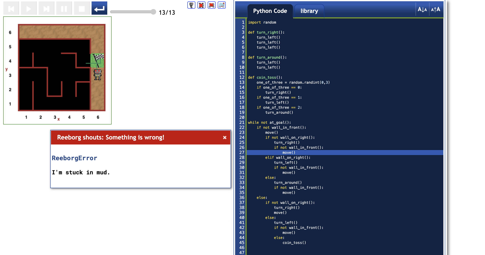

# Minor bug alert!

As depicted in the figure below, there is a minor bug in this code, which occurs only after Reeborg has successfully reached the destination.

## Why the bug occurs?

Short answer: The bug occurs because the code does not enable Reeborg to check that he has reached the destination.



### Step by step analysis

The bug occurs in the scenario where Reeborg starts off at the (5,4) grid position while facing the exit.

Since there is no wall in front, he moves forward through the exit, and reaches the destination.

The lines of code executed thus far are the lines 21, 22 and 23. That is:

```
while not at_goal():
    if not wall_in_front():
        move()
```

After executing line 23, Reeborg has reached the destination and the `at_goal()` condition is `True`.

However, the next line of code does not check if the `at_goal()` condition is `True` or `False`.

Execution then continues with lines 24 to 27:

```
        if not wall_on_right():
            turn_right()
            if not wall_in_front():
                move()
```

So, since there was no wall on the right, Reeborg turned right.

And after turning right, since there is no wall in front, he moved forward into the mud.

See the fix in [fix-minor-bug-1](fix-minor-bug-1.md)

---

\ \ -------- ... -------- / / [Back to main >>](../README.md)
