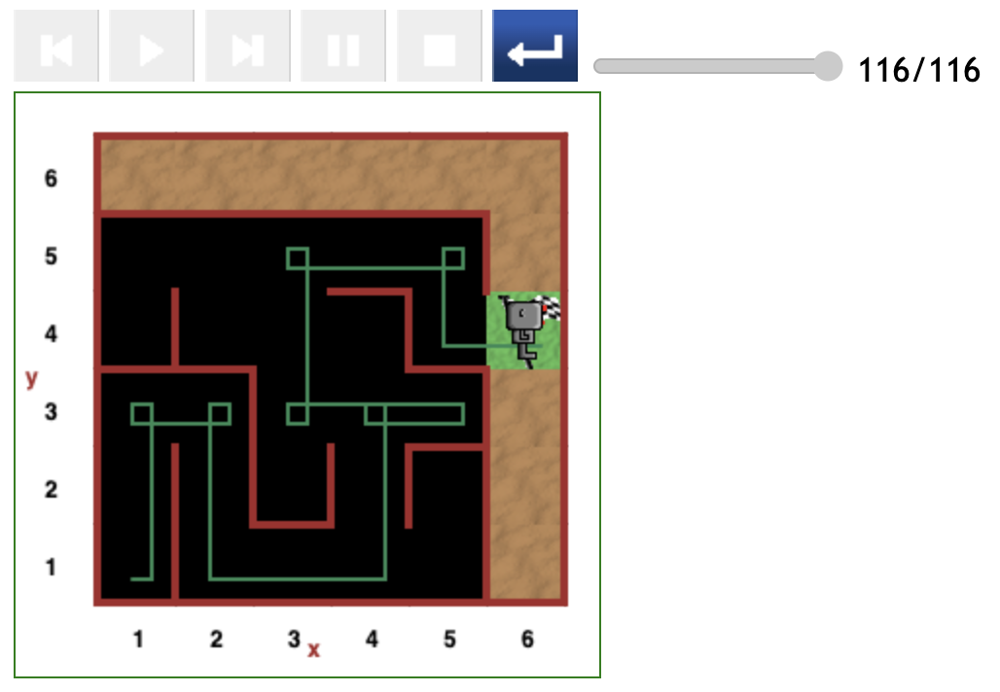
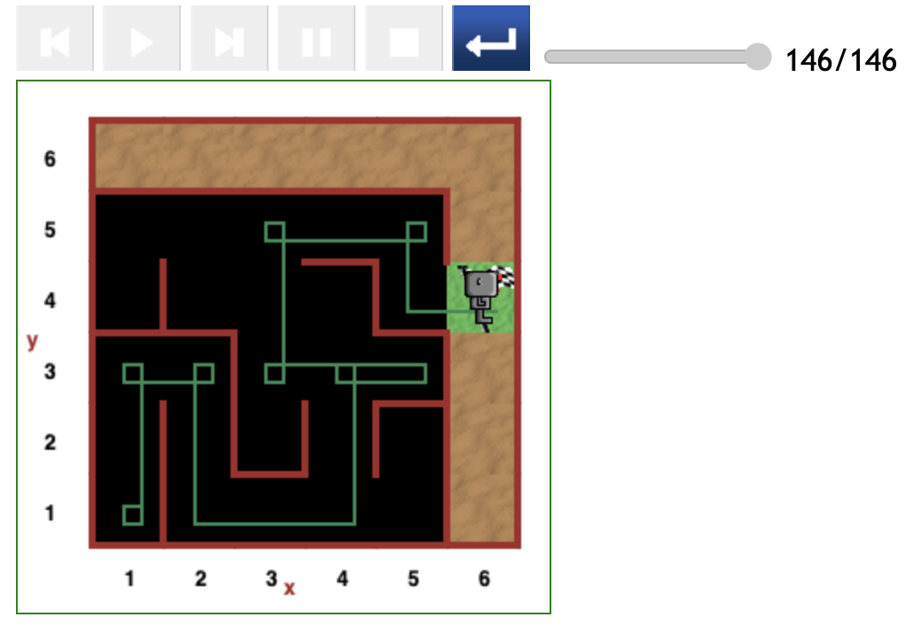

# Starting at position (1,1) in maze

Below are the paths followed by Reeborg the robot when starting at the (1,1) grid position.

The paths are presented in the increasing order of the number of steps of code spent from beginning to end.

## Relatively direct path (116 steps)

The figure below depicts an optimal, though not completely direct, path from the (1,1) position to the destination.

- The path in this scenario cost 116 steps of code from the beginning to the end.

## Relatively direct path (123 steps)

The figure depicts a relatively direct path from the (1,1) position to the destination exit (which is adjacent to the (5,4) position).

- A record of 123 steps code was executed.
- However, Reeborg executed an unnecessary left turn at the (2,1) position, this meant he had to make a right turn (equivalent to 3 left turns) to find the right direction, costing 4 extra steps of code.

## Relatively direct path (133 steps)

As depicted in the figure below, although Reeborg took the same direct path from the (1,1) grid position to the destination as in the first case above,

- He succeeded with an extra cost of 10 more steps of code.

## Relatively direct path (146 steps)

In view of the figure below it is clear that, depending on the initial direction Reeborg is facing, he can get stuck in a corner while spending a number of code steps just to manoeuvre out of it.

Thanks to the randomness in the code, Reeborg does not get stuck for ever.

## Concluding the subsection

An overall observation is that:

- Every path that includes Reeborg moving from (4,1) to (4,3) must also pass through the (5,3) position.

An optimal path from the (1,1) position to the destination should cost a minimum of 115 steps of code.

---

[<< Back to main](../README.md) \ \ -------- ... -------- / / [Next starting point >>](<starting-at-(1,2)-position.md>)
