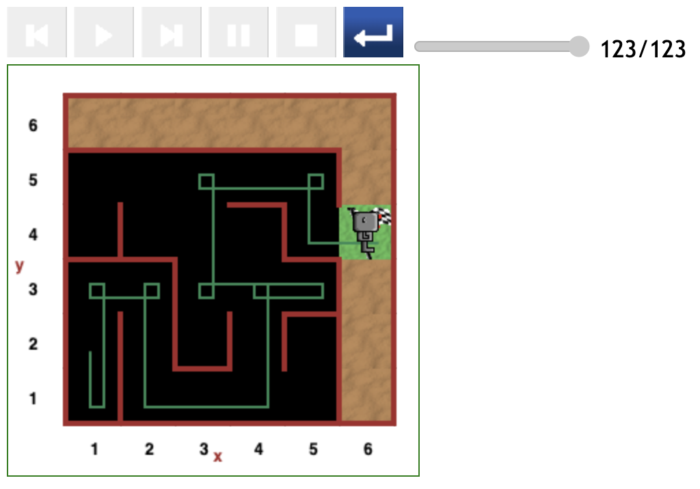
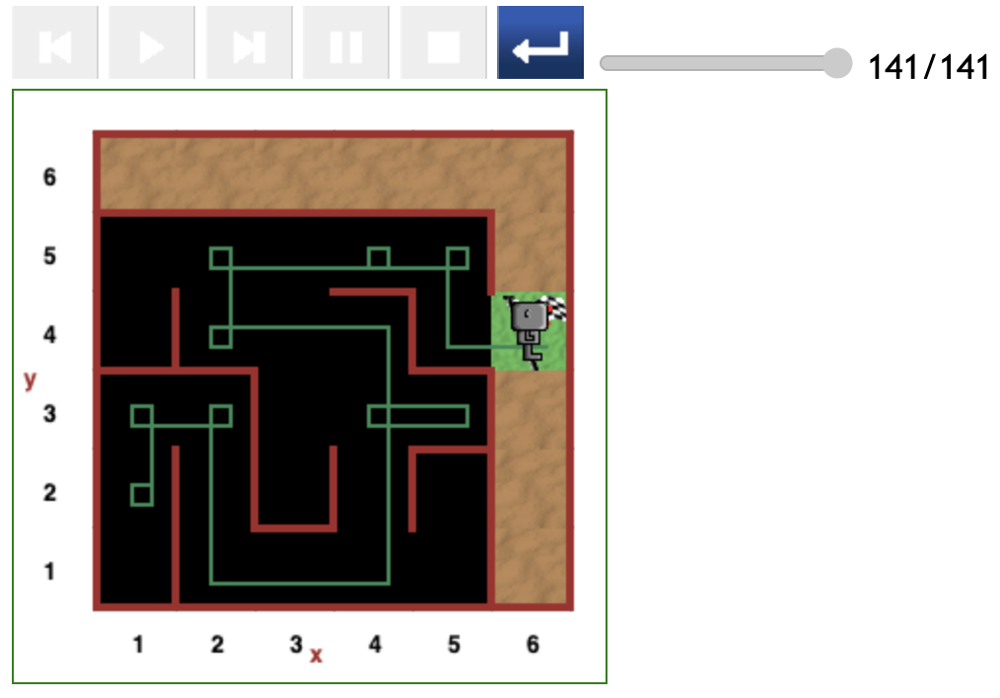
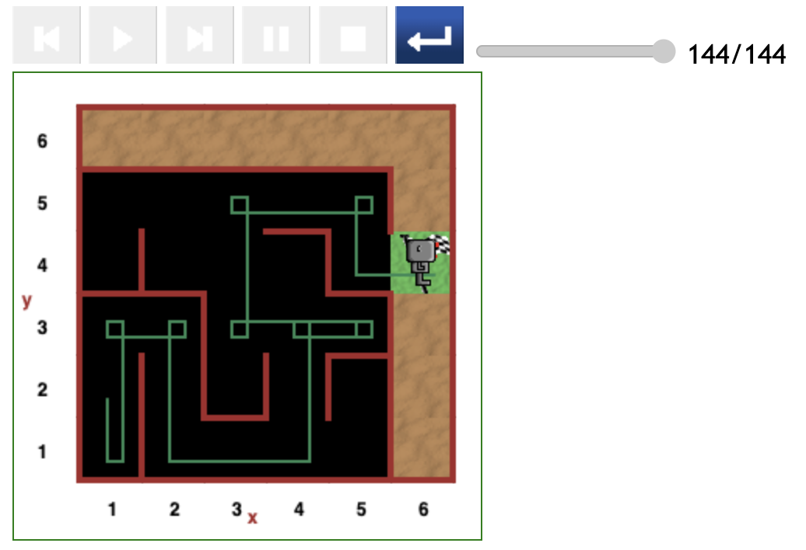

# Starting at position (1,2) in maze

Here are the paths Reeborg followed when starting at the (1,2) grid position.

Note how Reeborg always takes a right turn at the (4,3) position.

## Relatively direct path (116 steps)

In the figure below, Reeborg was initially facing the wall on the left. He therefore had to turn right, which amounts to 3 left turns, and costing 3 steps more than the optimal steps had he initially faced upwards (in the direction of the (1,3) position).

- Although relatively direct, it took 116 steps of code to complete the path.

## Relatively direct path (120 steps)

As in the above scenario, Reeborg was initially facing the wall on the left.

- Reeborg spent 4 steps of code more than the above scenario. Instead of a left turn, he took a right turn at the (5,3) position.

## Slightly roundabout path (123 steps)

The code is biased towards moving forward whenever the front is clear. Reeborg initially faced downwards (that is, facing the (1,1) position) simply moved forward, turned left twice and moved back to the (1,2) position.

- It took 123 steps of code to complete this path.
- Reeborg executed a simple _turn around_ at the (5,3) position.

## Relatively direct path (141 steps)

Although taking a relatively direct path, and executing a simple _turn around_ at the (5,3) position, Reeborg wasted extra steps of code at the (4,5) position.

- It cost 141 steps of code to complete this path. In addition to the (4,5) spin, it seems Reeborg spun around a few times at the beginning before moving to the (1,3) position.

## Slightly roundabout path (144 steps)

Compared to the 123-step case above, here Reeborg spent 21 extra steps of code by spinning around a few times at the (5,3) position. This amounts to 4 spins of manoeuvring at one position.

- It cost 144 steps of code for Reborg to complete this path.

## Relatively direct path (150 steps)

In this scenario, Reeborg started off following a more direct path until he reached the (5,3) and (4,5) positions where he spun around a few times, spending a total of 37 steps of code more than the 116-steps case above. (i.e., 150 - (116 - 3) = 37 due to the extra _turn right_ executed in the 116-steps case.)

- So, it took 150 steps of code for Reeborg to reach the destination.

## Roundabout path (171 steps)

The code proves to be erratic in this case as Reeborg spent a whooping 30 steps of code in comparison to the 141-step case above.

- The extra cost of 30 steps of code, compared to the 141-step case, is split between the spins executed at the starting position (1,2) and the (4,5) position.
- It took a total of 171 steps of code for Reeborg to complete this path.

## Concluding the subsection

As observed in all the other scenarios,

- Reeborg turns right at the (4,3) and thus manoeuvres to turn around at the (5,3) position.

Logically, an optimal path from the (1,2) position to the destination should cost a minimum 113 steps of code (and that's if Reeborg starts facing towards the (1,3) position.
