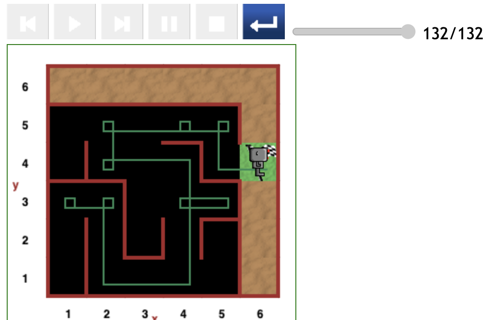
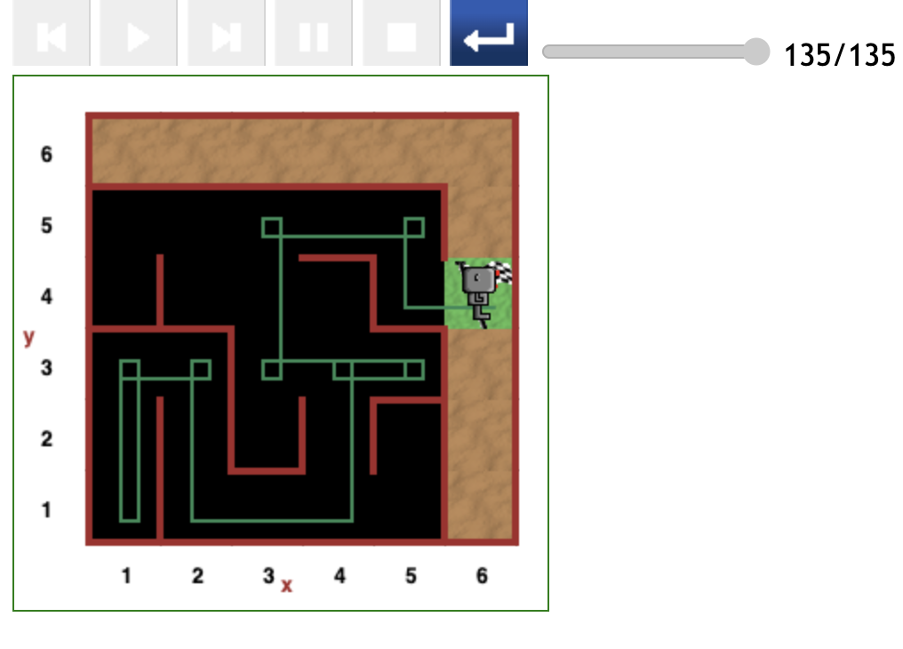
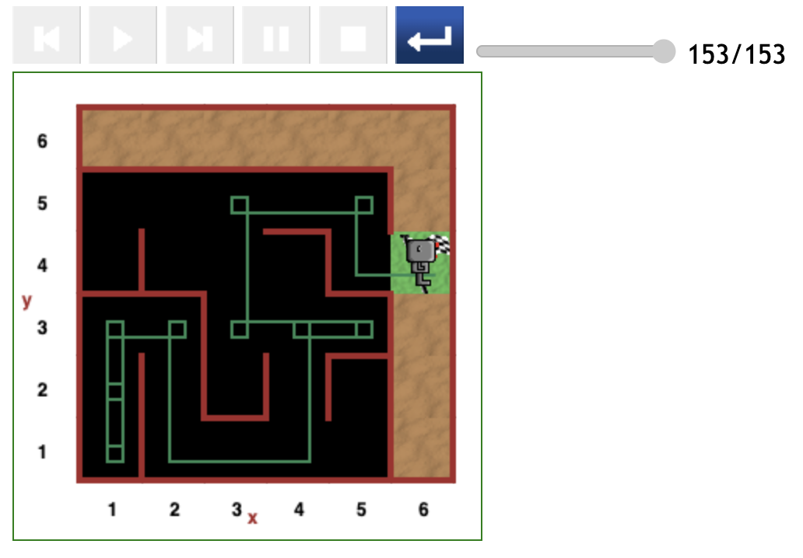

# Starting at position (1,3) in maze

Due to the shape of the this particular maze, position (1,3) is closer to the destination than the (1,1) and (1,2) positions.

We expect the most optimal path when starting at the (1,3) position to cost fewer steps of code than 113.

It is surprising that the relatively direct paths Reeborg followed in this round of testing clocks at least 124 steps of code.

## Relatively direct path (124 steps)

The path depicted in the figure below is generally direct except at the (4,5) position where Reeborg circled a few times before finding his way to the finish line.

- This path cost 124 steps of code to complete.

## Indirect path (131 steps)

In this third scenario Reeborg starts at the (1,3) position facing downwards, and the front being clear, he moved forward to the (1,1) position where he performed a clean _turn around_ manoeuvre.

This little detour cost an extra 7 to 8 steps of code compared to the 124-step scenario seen above.

- Reeborg spent 131 steps of code in this manoeuvre.
- Note that Reeborg traversed from the point (4,3) to (3,3) in this path, and this proves to be optimal compared to moving from point (4,3) to (4,4).

## Relatively direct path (132 steps)

In this scenario, Reeborg was initially facing upwards. With no wall on his right he is programmed to turn right (an equivalent of 3 _left turns_).

Reeborg was set to follow a direct path if we ignore the small (5,3) detour common to all paths passing through (4,1) and (4,3) grid positions.

- Despite following a relatively direct path compared to the 131-step scenario above, Reeborg spent 132 steps of code to reach the destination.

Why then is this scenario just 1 step of code more than the indirect 131-step scenario above?

It is due to the expensive path: Going from the (4,3) position, through (4,4), to the (2,4) position.

## Indirect path (135 steps)

The scenario depicted in the figure below illustrates the advantage of moving from the _(4,3) position to (3,3)_, instead of following the _(4,3) position, through (4,4), to the (2,4) position_.

- Although Reeborg takes a detour from the (1,3) position to the (1,1) position, which costs about 7 steps of code, it clocks only 3 extra steps of code compared to the relatively direct 132-step scenario above.
- Despite the extra spin performed at the (5,3) position, which costs about 4 steps of code, this scenario costs 135 steps of code.

## Indirect path (153 steps)

The randomization function named `coin_toss()`, and called in line 47 of [help-robot-in-maze.py](https://github.com/EmpieichO/Robot-In-A-Maze/blob/main/help-robot-in-maze.py#L47) code, causes an Reeborg's erratic behaviour.

- In the scenario below, Reeborg took a detour from the (1,3) position to the (1,1) position and spun around a few times.
- Although the path is the same as the one in the 135-step scenario above, Reeborg took an extra 18 steps of code before reaching the destination.

## Concluding the subsection

Although Reeborg always finds his way to the destination, the scenarios depicted thus far illustrate how non-deterministic the code is.

It is clear that optimal paths exist but the randomization introduced in the code favours success rather than an efficient dash to the destination.

---

[<< Previous starting point](<starting-at-(1,2)-position.md>) \ \ -------- ... -------- / / [Next starting point >>](<starting-at-(2,3)-position.md>)
