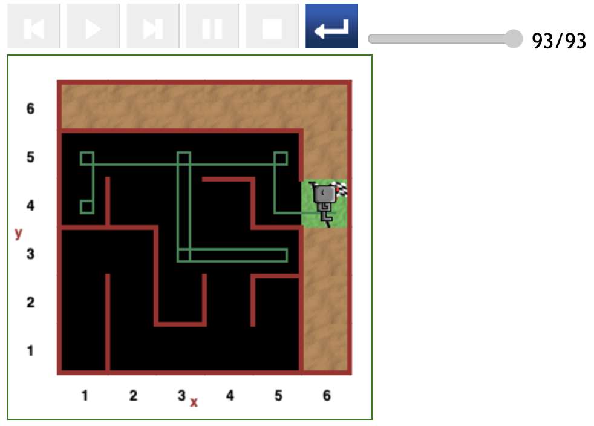

# Starting at (1,4) position in maze

Considering Reeborg's randomly varying initial direction, these two yielded paths, starting at the (1,4) position in this round of testing, are typical and most likely the most optimal.

This conclusion is based on two observations:

- Firstly, the 2 `no wall_on_right` spaces between positions (1,5) and (4,5) combined with the built-in bias to _turn right_ in the code.
- Secondly, as previously observed and maybe related to the above-mentioned code bias, there exists a tacit rule that Reeborg always obeys: _Perform only 2 consecutive `move()` in each beeline_.

---

[<< Previous starting point](<starting-at-(2,4)-position.md>)\ \ -------- ... -------- / / [Next starting point >>](<starting-at-(1,5)-position.md>)

<!-- \ \ -------- ... -------- / / [Next >>](minor-bug-1-report.md) -->
