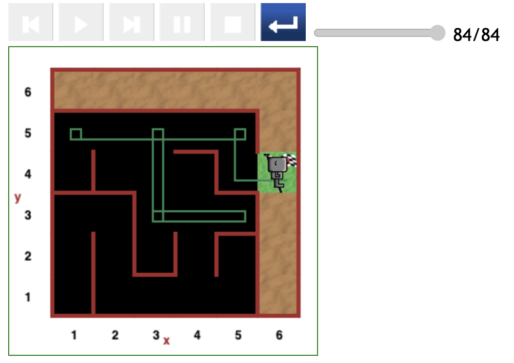
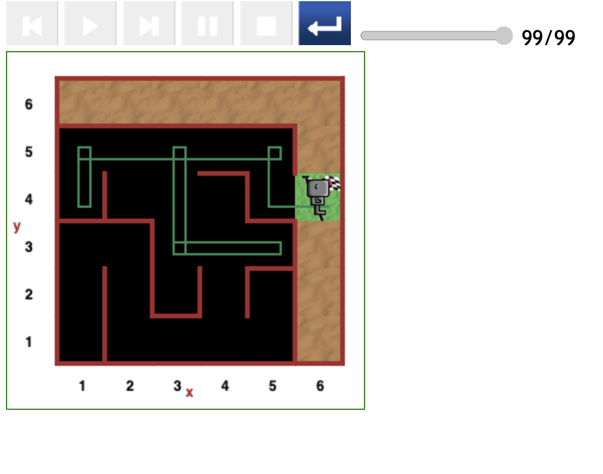
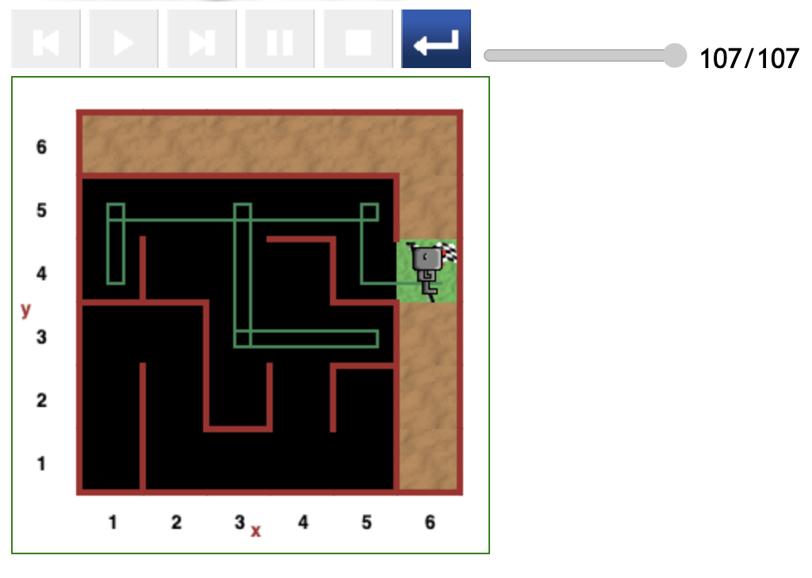

# Starting at (1,5) position in maze

The paths generated in the (1,5) starting-point scenarios follow the same pattern as those discussed in the [(1,4) starting point](<starting-at-(1,4)-position.md>) subsection.

The same conclusion that the paths displayed below are typical and most optimal for the (1,5) starting point.

This conclusion is based on the same two reasons:

- The double `no wall_on_right` spaces between positions (1,5) and (4,5) are unique to paths starting at both the (1,5) and (1,4) positions.
- Reeborg always obeys the tacit rule: _Perform only 2 consecutive `move()` in each beeline_.

## Relativel direct path (84 steps)

Reeborg started off facing upwards and turned right.

Thereafter, Reeborg complied with the tacit rule and therefore turned right at the (3,5) position.

He then began a small detour to the (5,3) position.

## Relativel direct path (99 steps)

Reeborg started off facing downwards, so moved to the (1,4) position, made a clean _turn around_, moved back to the (1,5) position, and turned right.

Subsequently, Reeborg followed the tacit rule and went into a small detour to the (5,3) position.

## Slightly indirect path (107 steps)

The 107-step path depicted in the figure below, looks exactly the same as the 99-step above.

The difference of 8 steps of code is traceable to Reeborg possibly cycling repeatedly between the (5,1) and (4,1) positions.

---

[<< Previous starting point](<starting-at-(1,4)-position.md>) \ \ -------- ... -------- / / [Next starting point >>](<starting-at-(2,5)-position.md>)

<!-- \ \ -------- ... -------- / / [Next >>](minor-bug-1-report.md) -->
