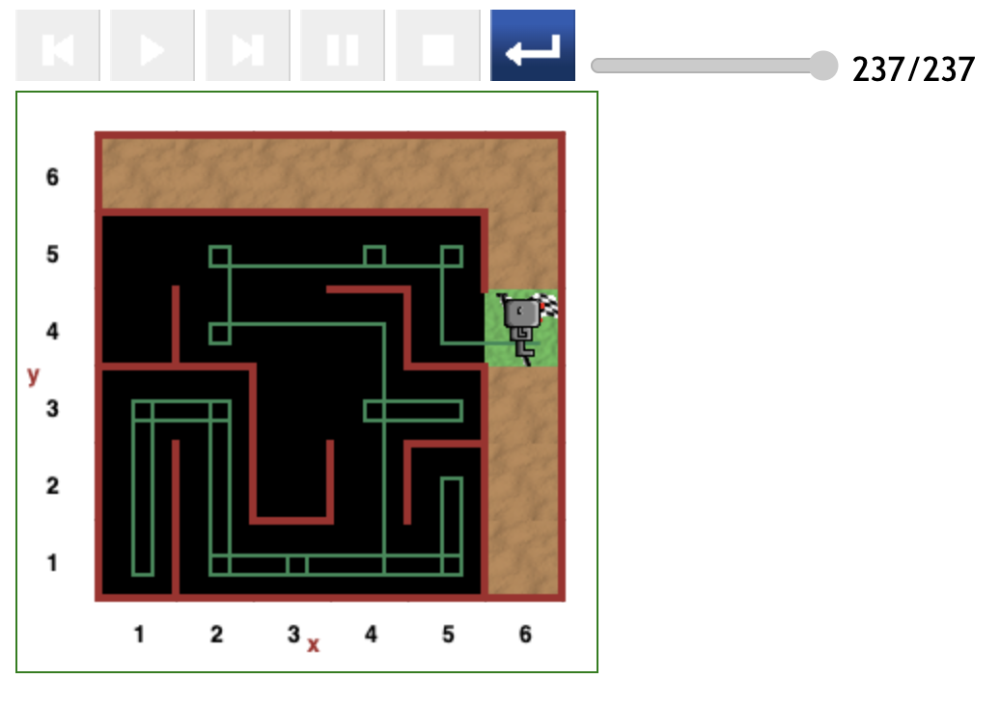

# Starting at (2,1) position in maze

The figure below depicts the only path that starts at the (2,1) position in this round of testing.

It happens to be the least optimal path as Reeborg embarked on detour to the (5,2) grid position after which it looped back to (2,1) and starting another detour to the (1,1) position.

- This path costs 237 steps of code to reach the destination.

---

[<< Previous starting point](<starting-at-(2,2)-position.md>) \ \ -------- ... -------- / / [Next starting point >>](<starting-at-(3,1)-position.md>)
