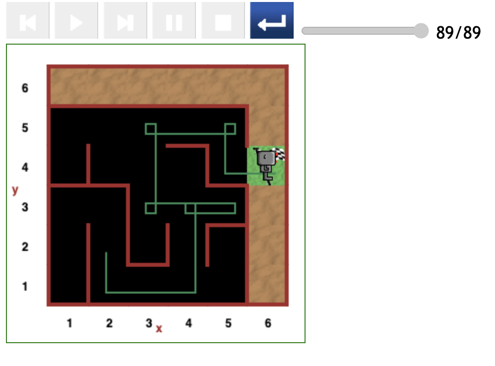
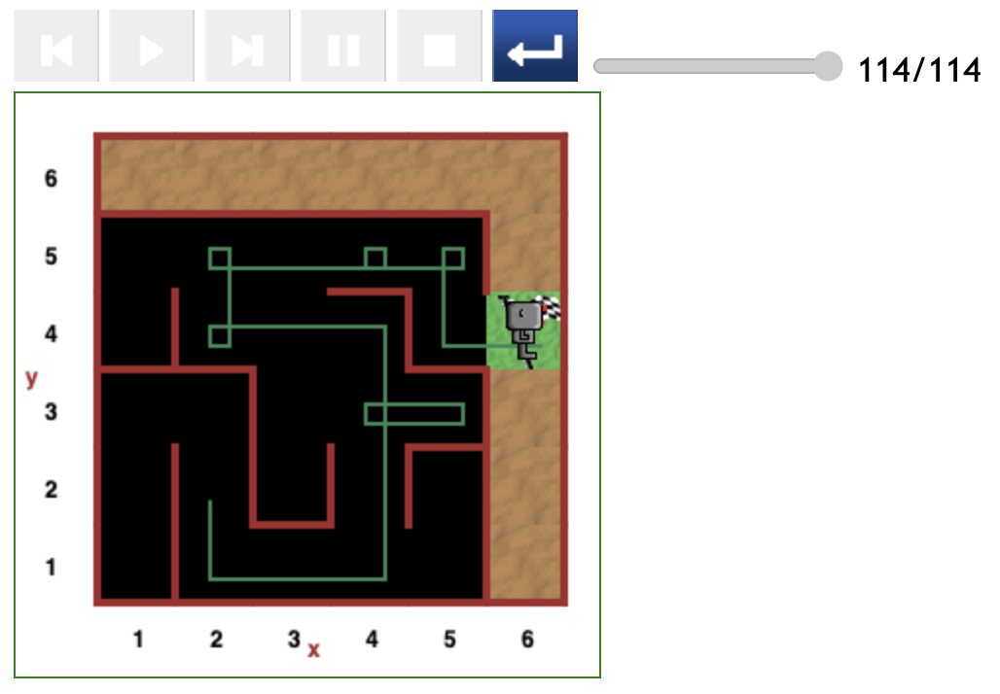
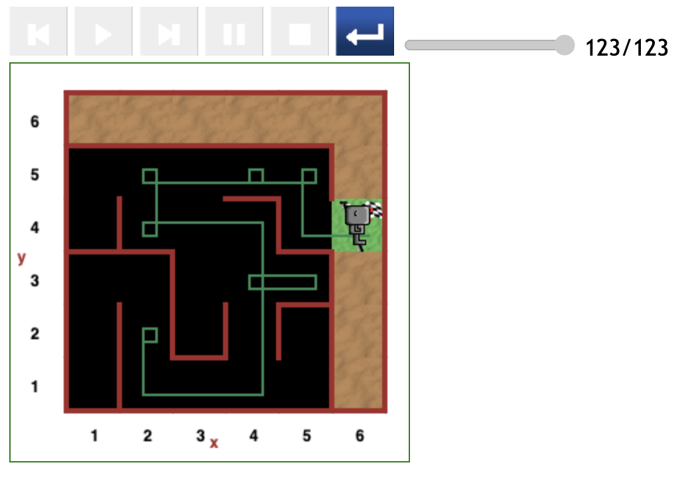
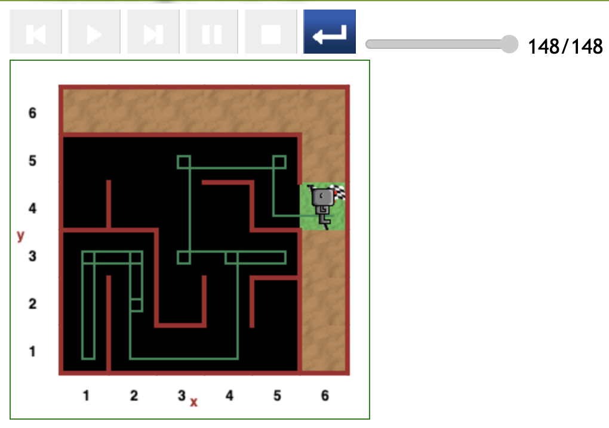
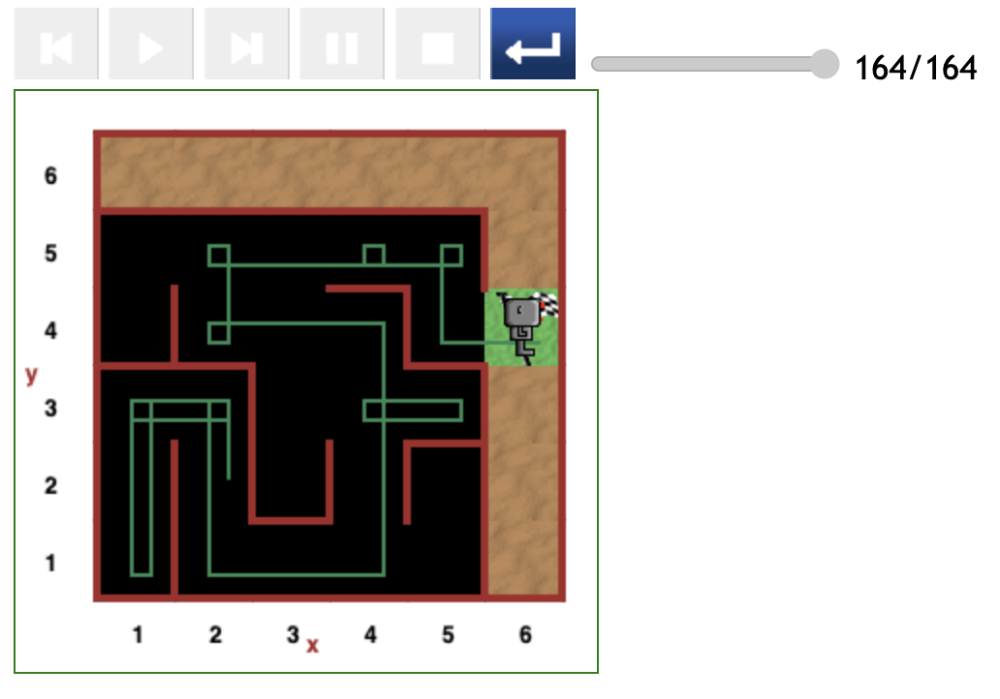
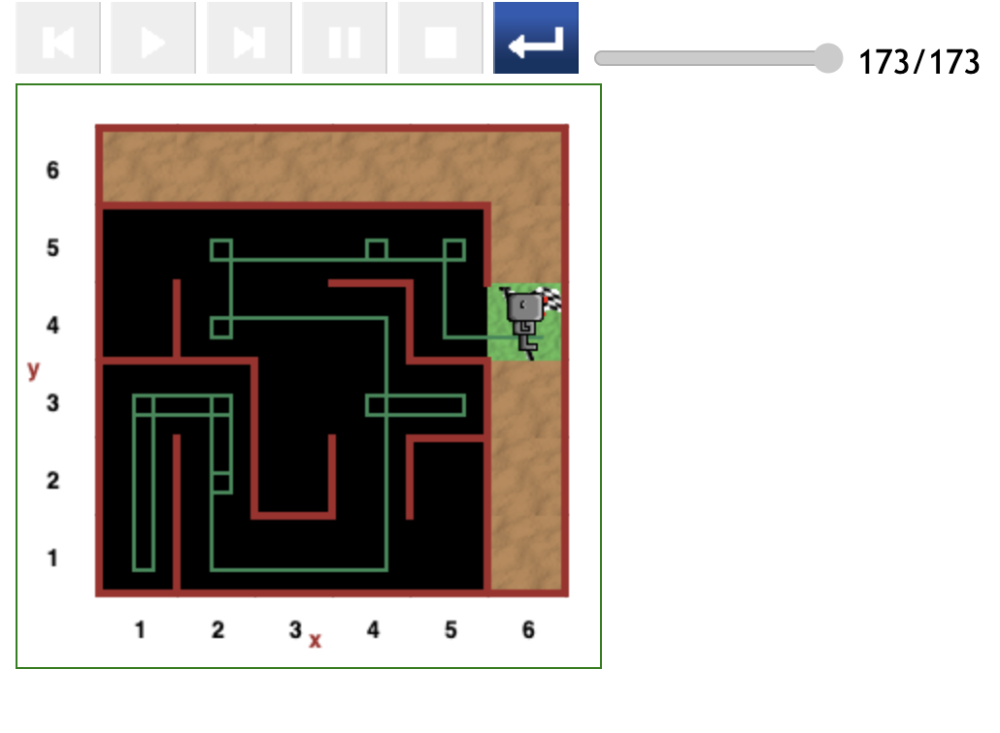

# Starting at (2,2) position in maze

The resultant paths in this round of testing further substantiate the fact that the subpath that passes _through the (4,3) position to (4,4)_ is the most optimal.

---

[<< Previous starting point](<starting-at-(2,3)-position.md>) \ \ -------- ... -------- / / [Next starting point >>](<starting-at-(2,1)-position.md>)
