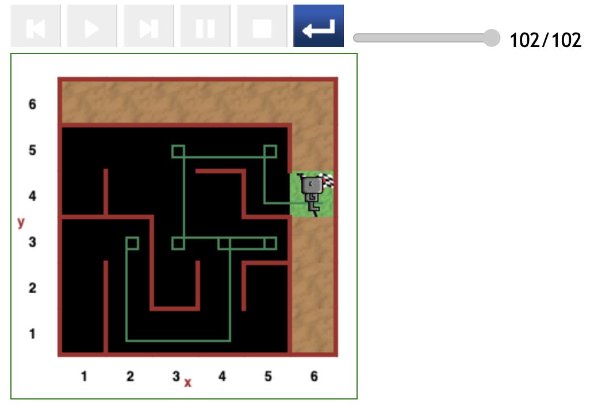
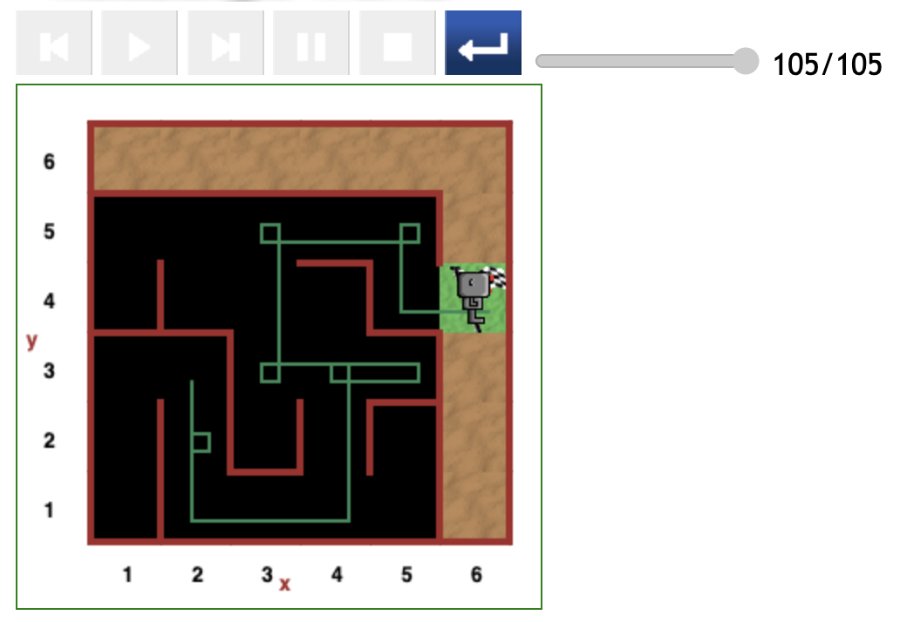
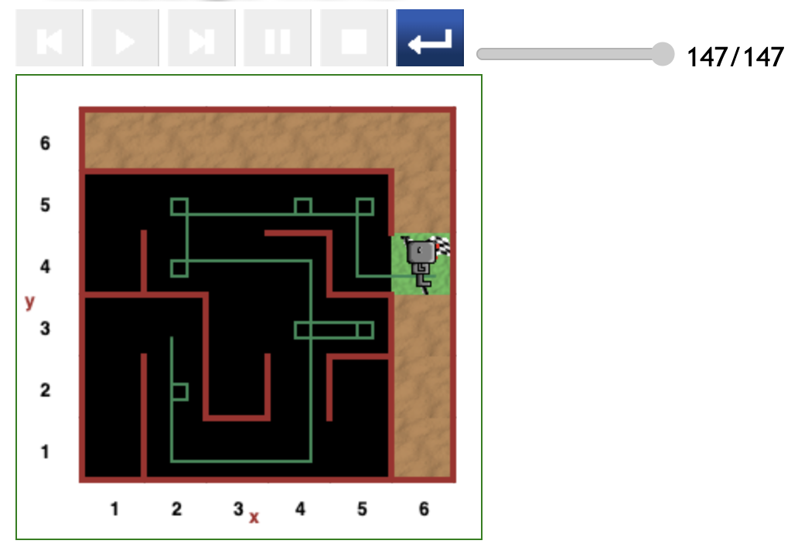

# Starting at position (2,3) in maze

Testing paths starting from the (2,3) position yielded some of the most optimal scenarios.

## Relatively direct path (102 steps)

The figure below depicts the most direct and efficient path in this round of testing.

Reeborg was initially facing the wall where his right hand side was clear. In such a situation he is programmed to turn right.

Once he took that first _right turn_, he followed a relatively direct path to the destination except for the common (5,3) detour and performing an extra spin while in that corner.

- As expected Reeborg took fewer than a 113 steps of code. The exact cost is 102 steps of code.

## Relatively direct path (105 steps)

Next is the scenario where Reeborg starts facing downwards. And as expected, he moved to the (2,2) grid position.

Instead of proceeding to the (2,1) grid position, Reeborg first performed a spin there.

Had it not been for this spin, he could have clocked about 100 steps of code.

## Relatively direct path (123 steps)

The scenario depicted below differs from the above scenarios in the subpath Reeborg followed when passing the (4,3) grid position to the destination.

We observe the disadvantage of taking a subpath that passes _through the (4,3) position to (4,4), then to the (2,4) position_ as opposed to _going from the (4,3) position straight to (3,3)_.

- Despite being a relatively direct path, except for the spin at the (4,5) grid position, Reeborg spent 123 steps of code.

## Indirect path (131 steps)

As depicted in the figure below, Reeborg started facing the (1,3) grid position with no wall in front, and thus moved forward and hence embarked on a detour to the (1,1) position before returning to the starting point.

Thereafter, Reeborg followed the most optimal path to the destination. He performed a clean _turn around_ manoeuvre at the (5,3) grid position.

- The total cost in steps of code is 131.

## Relatively direct path (147 steps)

Here Reeborg start off in a similar style to the 105-step scenario seen above but did not follow the optimal _(4,3) position to (3,3)_ subpath.

- Despite no major detours, this path cost 147 steps of code.

## Concluding the subsection

It is becoming clear that despite the randomness introduced in the code that causes Reeborg to embark on detours, there are some optimal subpaths and some _not so optimal_ ones.

---

[<< Previous starting point](<starting-at-(1,3)-position.md>)

<!-- \ \ -------- ... -------- / / [Next starting point >>](<starting-at-(1,3)-position.md>) -->
