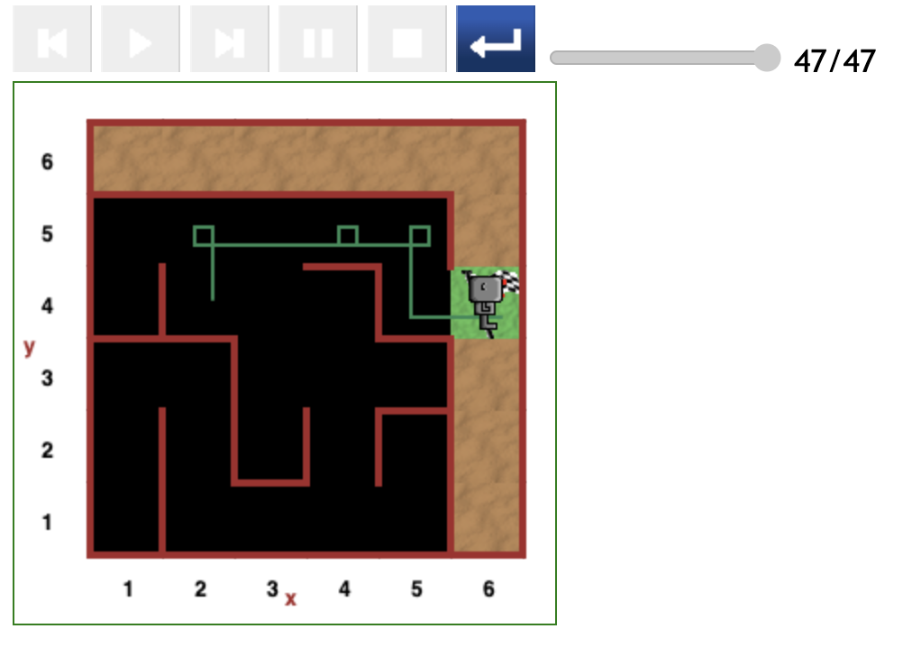

# Starting at (2,4) position in maze

The most optimal path for this starting point.

---

[<< Previous starting point](<starting-at-(4,4)-position.md>)\ \ -------- ... -------- / / [Next starting point >>](<starting-at-(1,4)-position.md>)

<!-- \ \ -------- ... -------- / / [Next >>](minor-bug-1-report.md) -->
