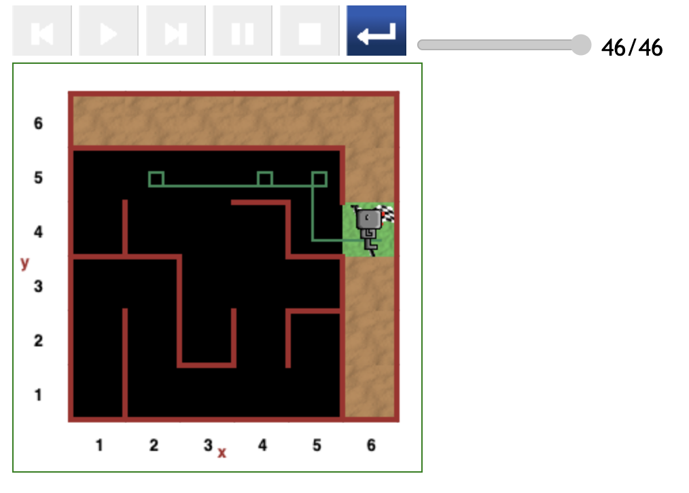

# Starting at (2,5) position in maze

## Direct path (46 steps)

The path depicted in the figure below is the most optimal for paths starting at (2,5).

- The cost in steps of code for this path is 46.



## Slightly indirect path (75 steps)

The path in the figure below has a minor detour ascribable to the following lines of code:

```
while not at_goal():
    if not wall_in_front():
        move()
```

Since Reeborg was initially facing Right and there is no wall in front, he moved from the starting point to the (3,5) position.

He continued by following the next lines of code:

```
        if not wall_on_right():
            turn_right()
            if not wall_in_front():
                move()
```

He turned right and moved from the (3,5) position to the (3,4). And so a minor detour ensued.


## Indirect path (117 steps)

In this case Reeborg started off facing Left, and similarly followed the first three lines of the while loop:

```
while not at_goal():
    if not wall_in_front():
        move()
```

The was not wall in front so he moved from (2,5) to (1,5).

Reaching (1,5) with the wall in front, Reeborg continued according to these lines:

```
        elif wall_on_right():
            turn_left()
            if not wall_in_front():
                move()
```

He turned left and moved from (1,5) to (1,4).

At this stage, since there is a wall in front, Reeborg followed the outer `else`-part of the while loop:

```
    else:
        if not wall_on_right():
            turn_right()
            move()
        else:
            turn_left()
            if not wall_in_front():
                move()
            else:
                coin_toss()
```

He turned left and with the `coin_toss()` performed a `turn_right()`, ending up facing Left.

With a wall in front and no wall on the right, Reeborg turned right and moved from (1,4) to (1,5) according to the first lines of the while loop again.

Back at (1,5) Reeborg performed the routine of turning right and `move()`.


---

[<< Previous starting point](<starting-at-(1,5)-position.md>) \ \ -------- ... -------- / / [Next starting point >>](<starting-at-(3,5)-position.md>)
