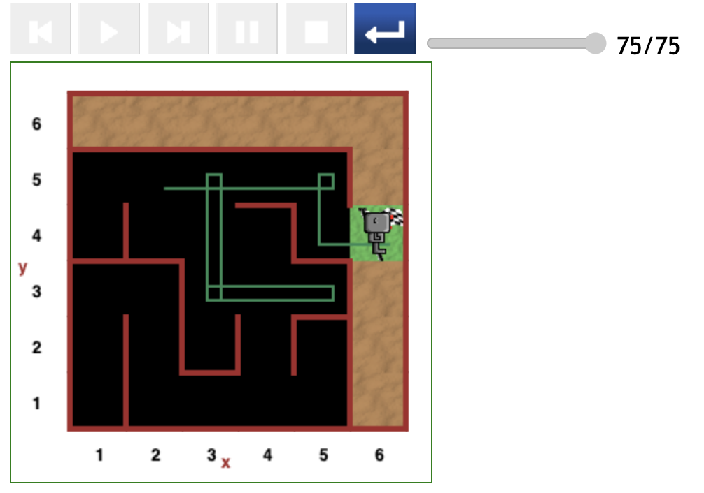
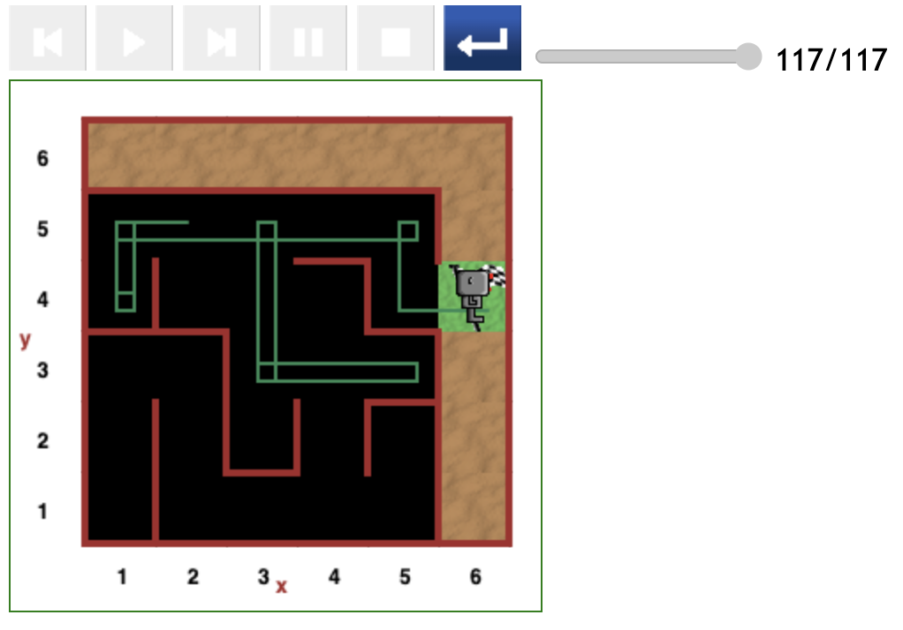

# Starting at (2,5) position in maze

## Direct path (46 steps)

The path depicted in the figure below is the most optimal for paths starting at (2,5).

## Slightly indirect path (75 steps)

## Indirect path (117 steps)

---

[<< Previous starting point](<starting-at-(1,4)-position.md>) \ \ -------- ... -------- / / [Next starting point >>](<starting-at-(2,5)-position.md>)

<!-- \ \ -------- ... -------- / / [Next >>](minor-bug-1-report.md) -->
