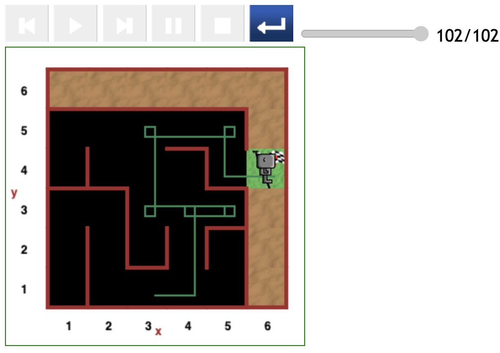
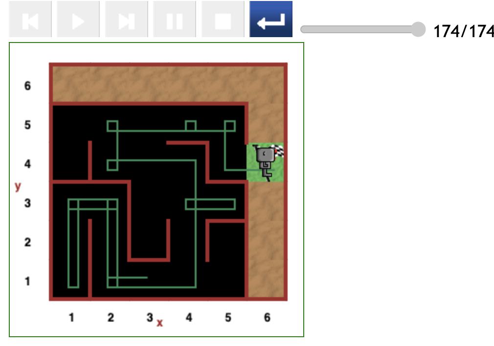
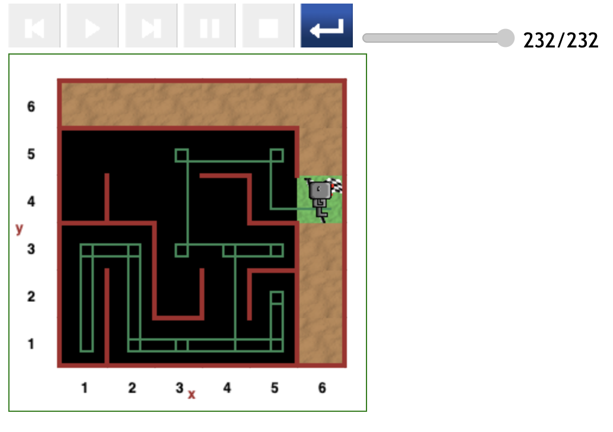

# Starting at (3,1) position in maze

There three paths produced starting from the (3,1) grid position in this testing round,

- One relatively direct path costing 102 steps of code.
- And two paths with one or two detours.

## Relatively direct path (102 steps)

## Indirect path (174 steps)

In the path depicted below, Reeborg starts facing the (2,1) position, and therefore moves forward as there is no wall in front.

- Reeborg takes a detour to the (1,1) position and back. Now facing the right direction, Reeborg follows a relatively direct path to the destination.
- The detour to the (1,1) position together with the less optimal subpath (i.e., _going from (4,3) through (4,4) to (2,4)_), caused Reeborg to spend a total of 174 steps of code to find the destination.

## Indirect path (232 steps)

In the path below, Reeborg took two detours:

- The first is a detour to the (5,2) grid position.
- The second is a detour to the (1,1) position.

The complete path cost 232 steps of code.

---

[<< Previous starting point](<starting-at-(2,1)-position.md>) \ \ -------- ... -------- / / [Next starting point >>](<starting-at-(4,1)-position.md>)
