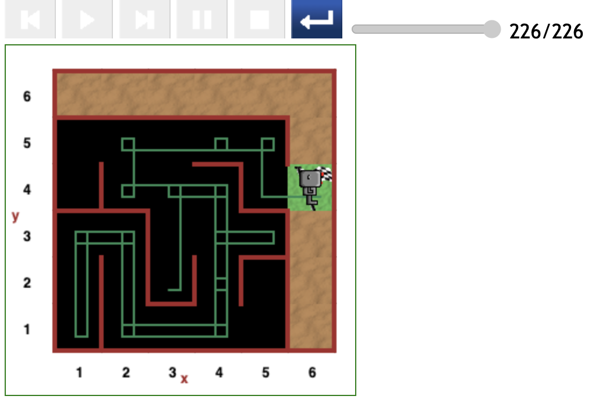

# Starting at (3,2) position in maze

In this round of testing, there was only one path starting at the (3,2).

This scenario is the point in case of the tacit rule: _Only 2 moves in each beeline_.

Reeborg obeyed the tacit rule and thus began a major detour to the (1,1) grid position.

- The total cost was 226 steps of code.

---

[<< Previous starting point](<starting-at-(3,3)-position.md>) \ \ -------- ... -------- / / [Next starting point >>](<starting-at-(3,4)-position.md>)
