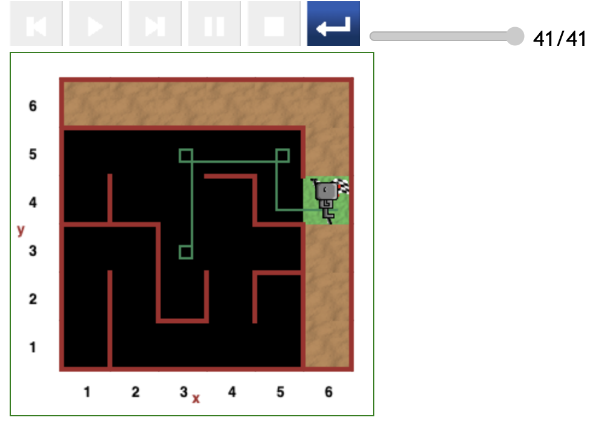
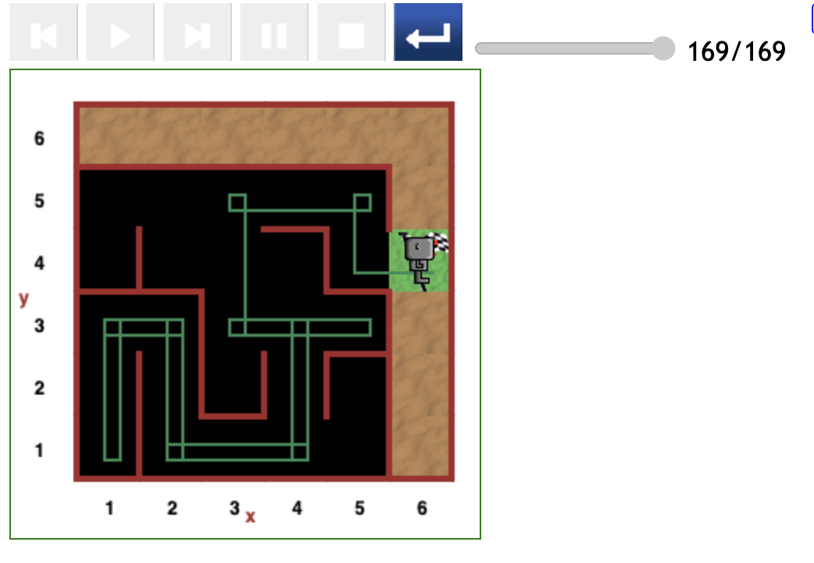
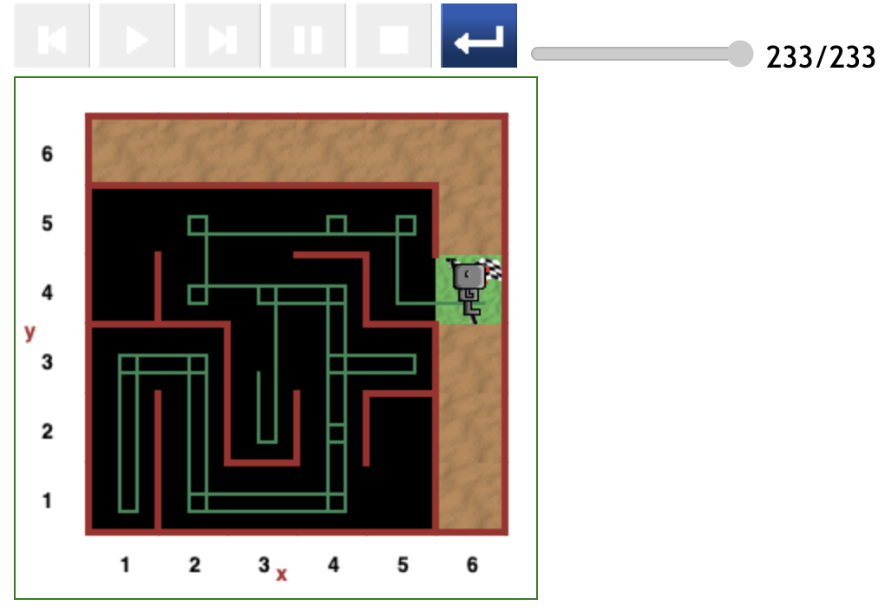

# Starting at (3,3) position in maze

The paths the code produced for this starting position reveal the tendency for Reeborg to make 2 moves in one direction and a change direction.

The occurrence of 3 consecutive moves in one straight line hardly occurs.

## Optimal path (41 steps)

The figure below depicts the most optimal. It occurs when Reeborg starts off facing the only wall at the position, in the (2,3) direction.

## Indirect path (169 steps)

In this scenario, Reeborg embarks on one major detour to the (1,1) grid position.

After returning to the starting point, he followed the most direct subpath.

## Indirect path (233 steps)

In this scenario, Reeborg started facing downwards with no wall in front, and naturally moved forward to the (3,2) grid position.

After executing a clean _turn around_, he made a beeline to the (3,4).

Since there was no wall in front, Reeborg should have proceeded to the (3,5) position.

But it seems to generally follow a tacit rule: _Only 2 moves in each beeline_.

This is where Reeborg embarked on a major detour to the (1,1) grid position.

---

[<< Previous starting point](<starting-at-(5,3)-position.md>) \ \ -------- ... -------- / / [Next starting point >>](<starting-at-(3,2)-position.md>)
