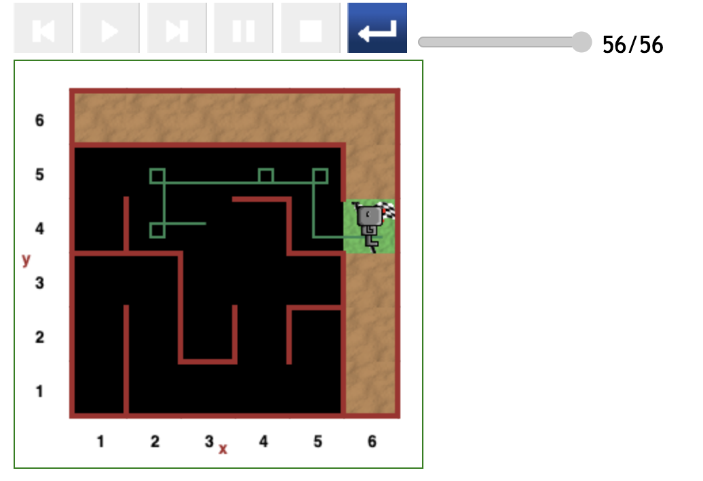
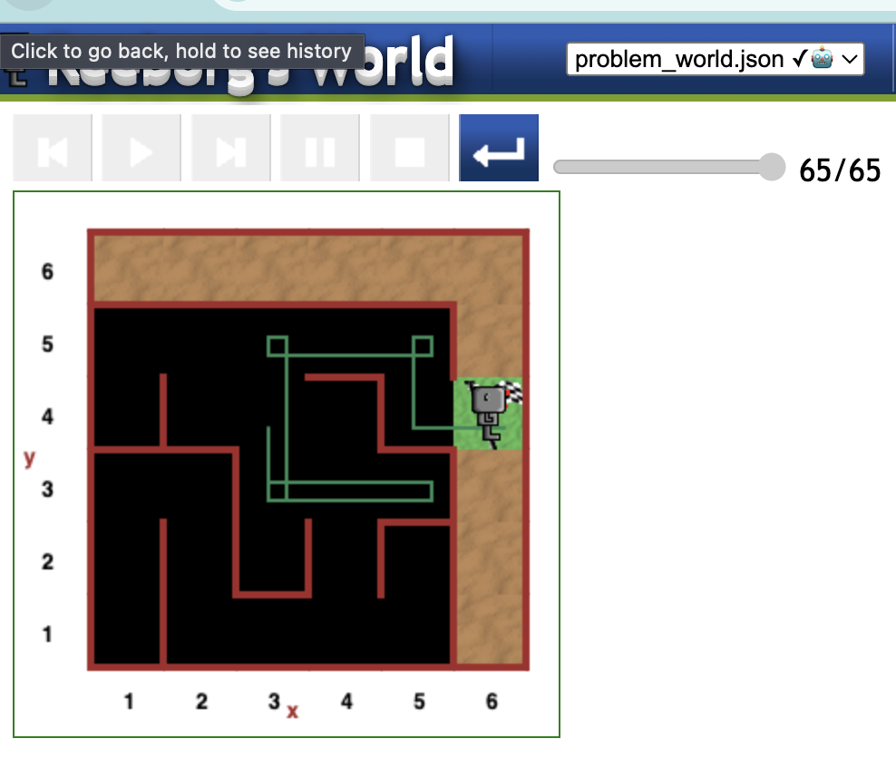
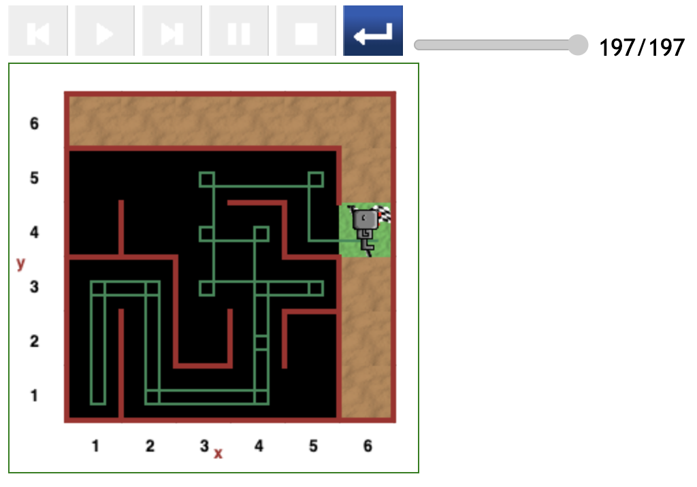
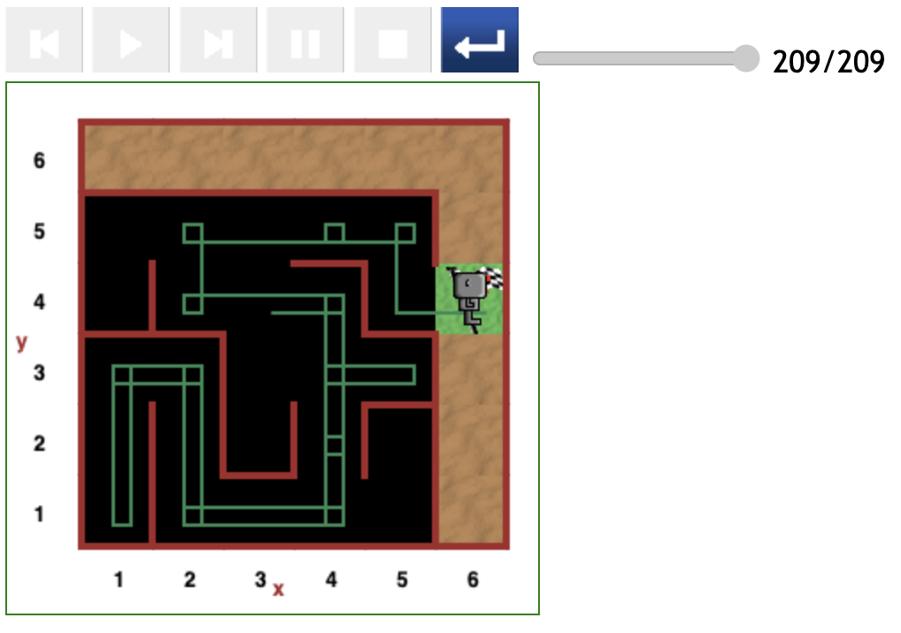

# Starting at (3,4) position in maze

The paths associated with this starting point depend mainly on the initial direction in which Reeborg is facing.

Since there are no walls in all four sides, and the code heavily relies on the presence of some wall, the variety of paths Reeborg can follow seems more.

## Optimal path (32 steps)

In the scenario depicted in the figure below, Reeborg follows the most optimal path for this starting position.

- The cost of traversing this path is 32 steps of code.


## Relatively direct path (56 steps)

In this scenarion, Reeborg was initially facing Left, and thus moved to the (2,4) position before taking the most direct path to the destination.

- This path costs 56 steps of code



## Slightly indirect path (65 steps)

As seen in the figure below, Reeborg started off facing downwards and therefore moved to the (3,2) position.

Since there is a wall on the right and the lines of code to be executed next are,

```
        if not wall_on_right():
            turn_right()
            if not wall_in_front():
                move()
        elif wall_on_right():
            turn_left()
            if not wall_in_front():
                move()
```

Reeborg turned left.

From this point on Reeborg moved forward because of the top of the `while` loop:

```
while not at_goal():
    if not wall_in_front():
        move()
```

- This path cost only 65 steps of code because of the small detour to the (5,3) position.



## Indirect path (197 steps)

In this scenario, it is hard to ascertain Reeborg's initial direction. However, it is clear that his first move was from the (3,4) position to (4,4).

Reeborg proceeded with a beeline from (4,4) to (4,2) where he circled before going to (4,1).

- This path cost 197 steps of code due to the detour to the (1,1) position.



## Indirect path (209 steps)

Reeborg started facing Right, and thus moved to the (4,4) position.

As in the above scenario, Reeborg embarked on a detour to the (1,1) position.

When returning, although executing a clean _turn around_ manoeuvre at the (5,3) position and thus saving a few steps of code.

- This path cost 209 steps of code (12 more than the above scenario) because Reeborg followed the less optimal subpath: _(4,3) -> (4,4) --> (2,4)_, and added an extra spin at the (4.5) position.



---

[<< Previous starting point](<starting-at-(3,2)-position.md>) \ \ -------- ... -------- / / [Next starting point >>](<starting-at-(3,4)-position.md>)
