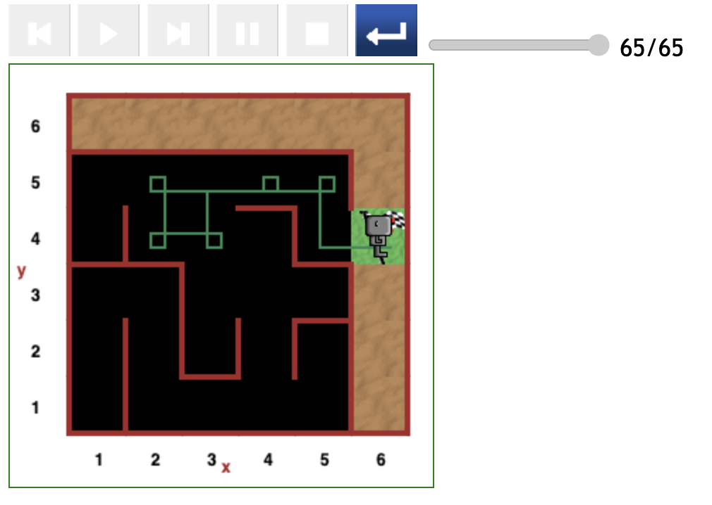
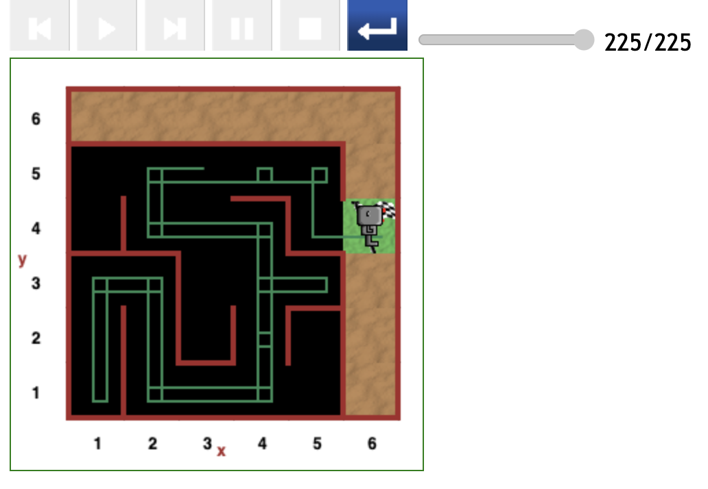

# Starting at (3,5) position in maze

The paths yielded in this round of testing demonstrate two relatively extreme cases:

- The most optimal path if Reeborg starts off facing downwards. Reeborg took a minimal detour to the (2,4) position then (2,5) and back.

- The worst case scenario where Reeborg starts off facing Left. Reeborg took a major detour to the (1,1) position.

---

[<< Previous starting point](<starting-at-(2,5)-position.md>) \ \ -------- ... -------- / / [Next starting point >>](<starting-at-(4,5)-position.md>)
