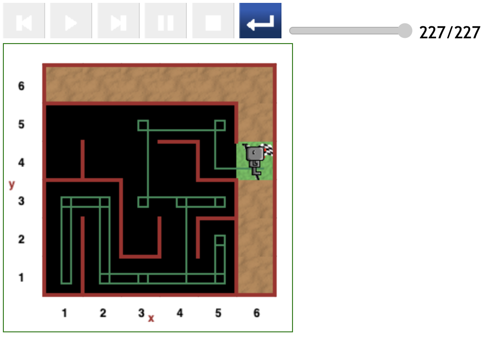
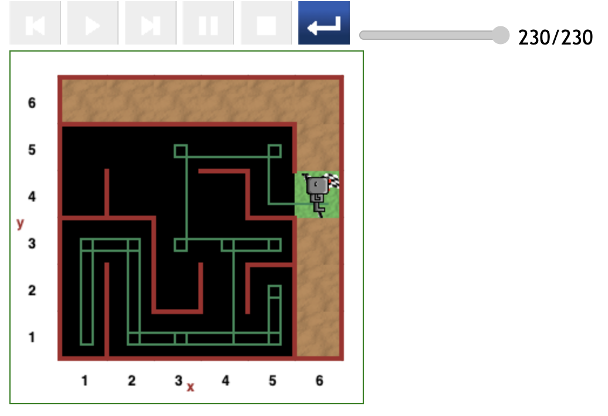

# Starting at (4,1) position in maze

---

[<< Previous starting point](<starting-at-(1,3)-position.md>)

 <!-- \ \ -------- ... -------- / / [Next starting point >>](<starting-at-(5,1)-position.md>) -->
