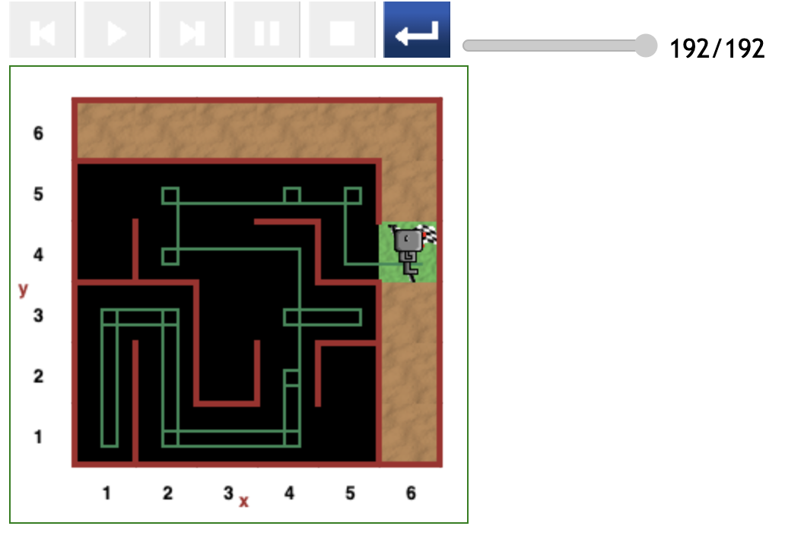
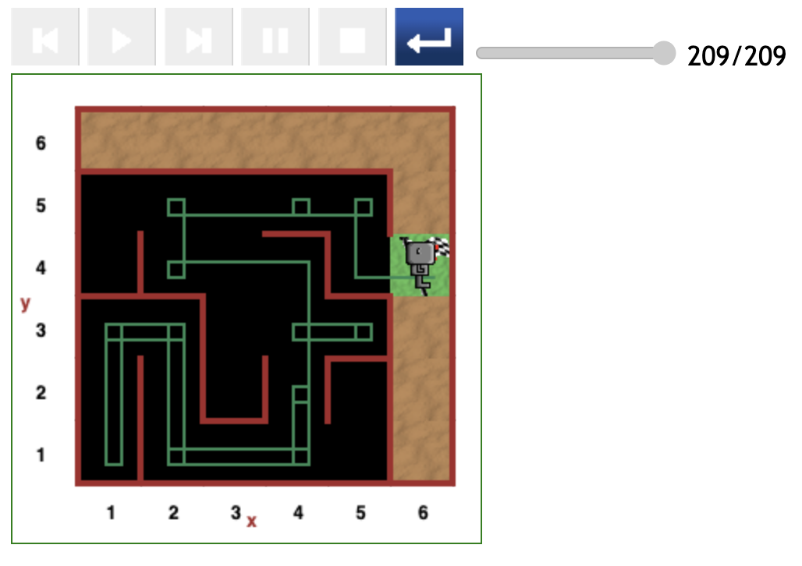

# Starting at (4,2) position in maze

## Optimal path (98 steps)

-best-path.png>)

## Indirect paths

[<< Previous starting point](<starting-at-(5,2)-position.md>)

\ \ -------- ... -------- / / [Next starting point >>](<starting-at-(4,3)-position.md>)
