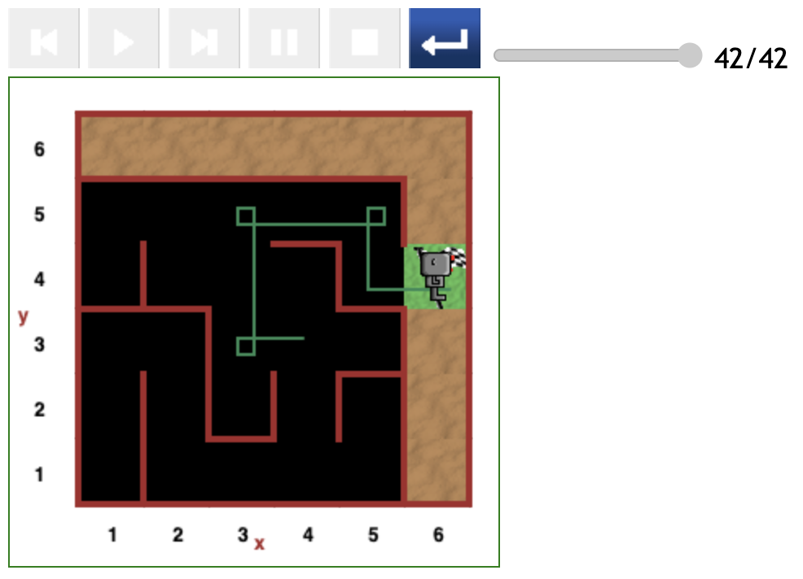
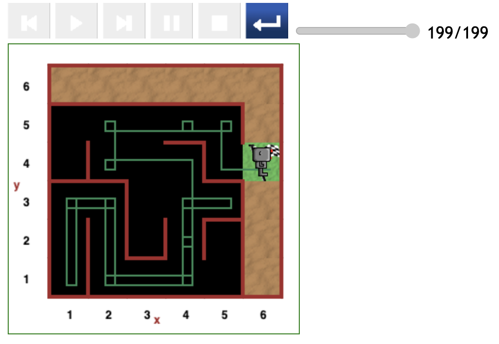

# Starting at (4,3) position in maze

The most optimal path at this position occurs when Reeborg starts off facing Left, towards the (3,3) position.

The second most optimal should occur when Reeborg starts off facing upwards, towards the (4,4) position.

## Direct path (42 steps)

## Relatively direct path (57 steps)

## Roundabout path (199 steps)

[<< Previous starting point](<starting-at-(4,2)-position.md>)

\ \ -------- ... -------- / / [Next starting point >>](<starting-at-(5,3)-position.md>)
