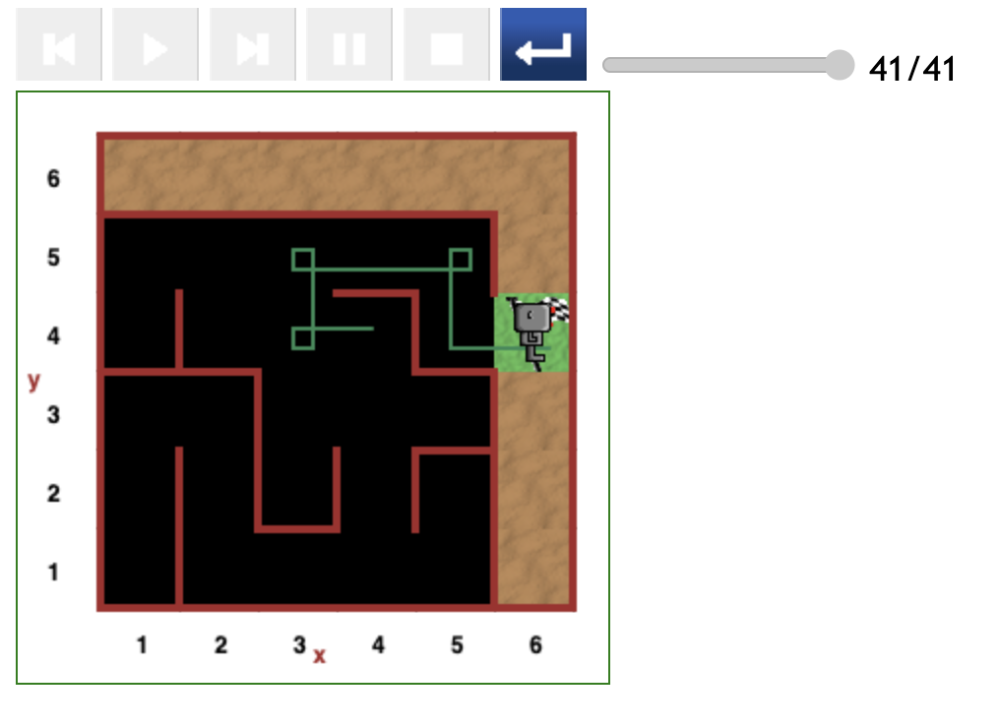
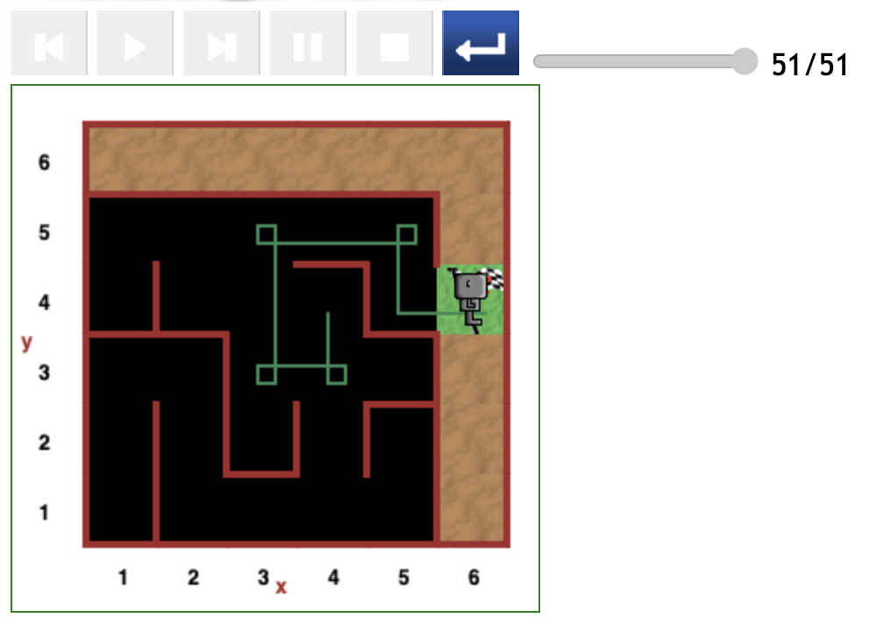
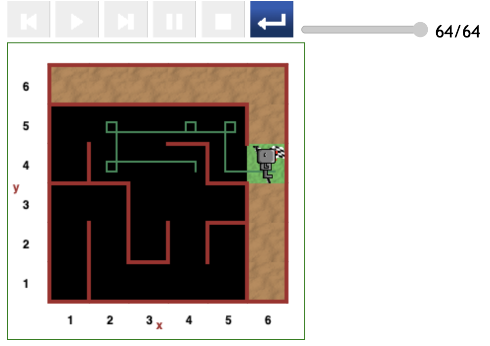
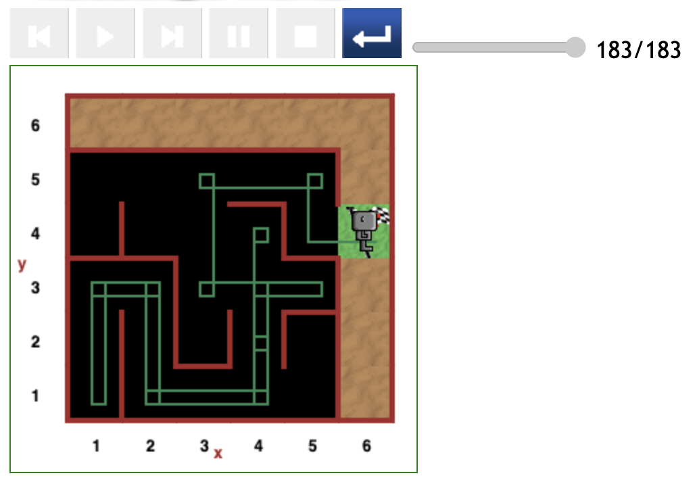

# Starting at (2,4) position in maze

Considering each of Reeborg's initial direction the first 3 paths displayed below are all reasonably direct.

## Direct path (41 steps)

The path shown in the figure below is outright direct. It is the most optimal.

- The path cost 41 steps of code.

## Reasonably direct path (51 steps)

The path depicted in the figure below is the most optimal for when Reeborg initially fact downwards.

- The path cost 51 steps of code to reach the destination.

## Relatively direct path (64 steps)

Although it is not clear why Reeborg didn't turn right at the (3,4) position, the overall path is relatively direct.

- The path cost 64 steps of code.

## Indirect path (183 steps)

This last scenario turns out to be expensive due to the major detour to the (1,1) position.

It is however not the most expensive path as Reeborg performed a clean _turn around_ at the (5,3) position instead of a spin.

In addition, Reeborg followed a more more optimal subpath: _(4,3) -> (3,3) -> (3,5)_.

- This path cost 183 steps of code to complete.

---

[<< Previous starting point](<starting-at-(3,4)-position.md>)

\ \ -------- ... -------- / / [Next starting point >>](<starting-at-(2,4)-position.md>)
