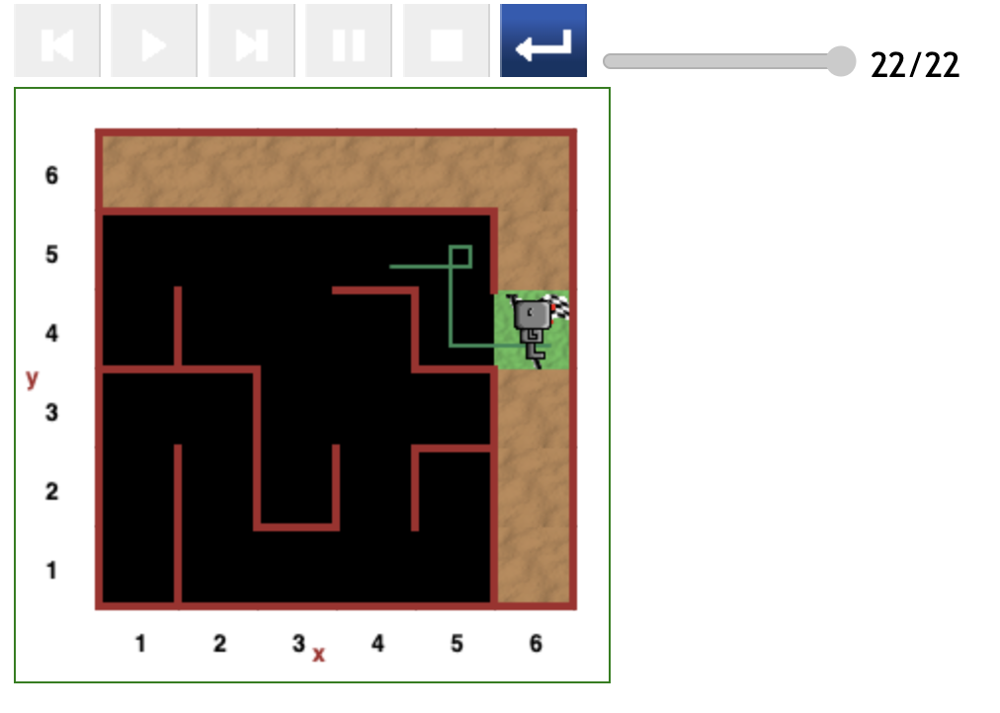
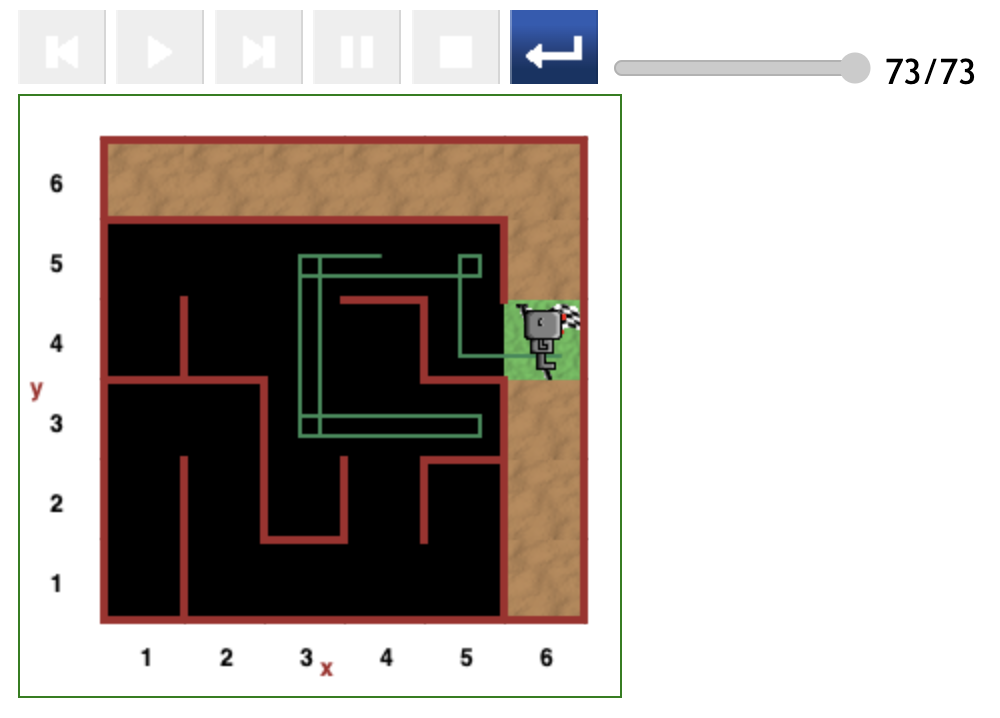
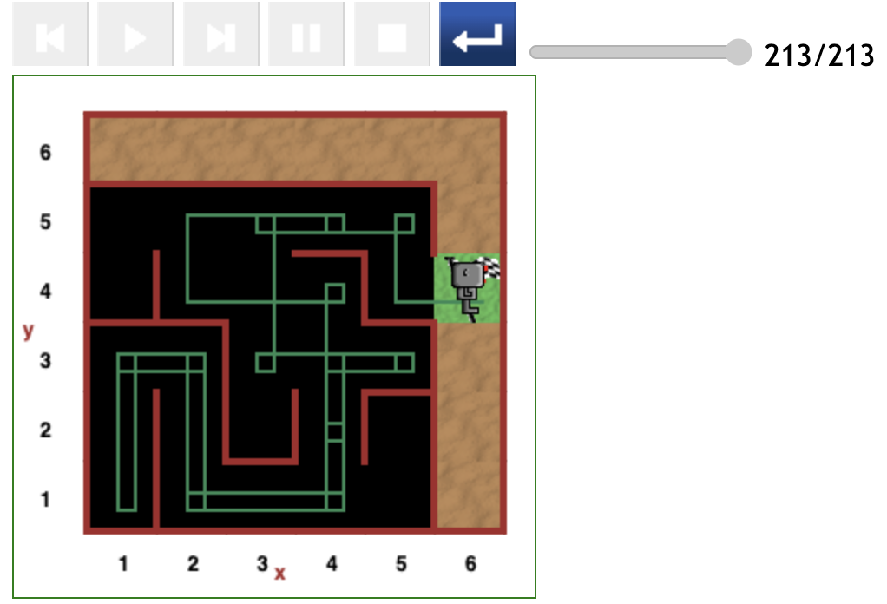

# Starting at (4,5) position in maze

The produced when Reeborg started at the (4,5) appear to be distinguished by the initial direction he was facing.

## Direct path (22 steps)

## Direct path (30 steps)

## Relatively direct path (73 steps)

## Indirect path (213 steps)

---

[<< Previous starting point](<starting-at-(3,5)-position.md>) \ \ -------- ... -------- / / [Next starting point >>](<starting-at-(5,5)-position.md>)
