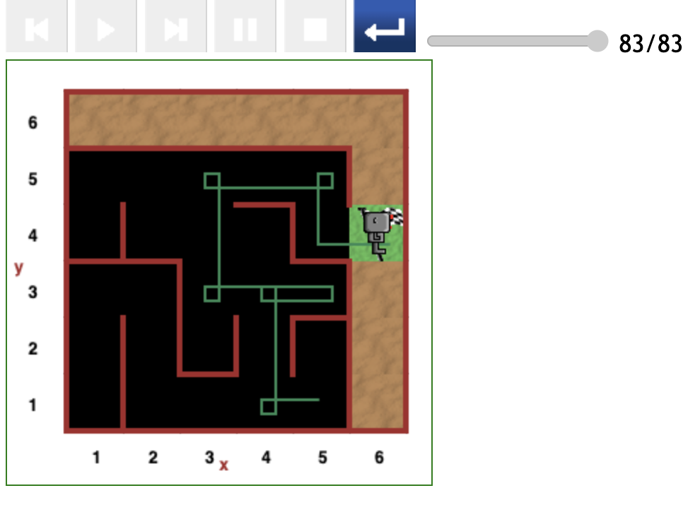
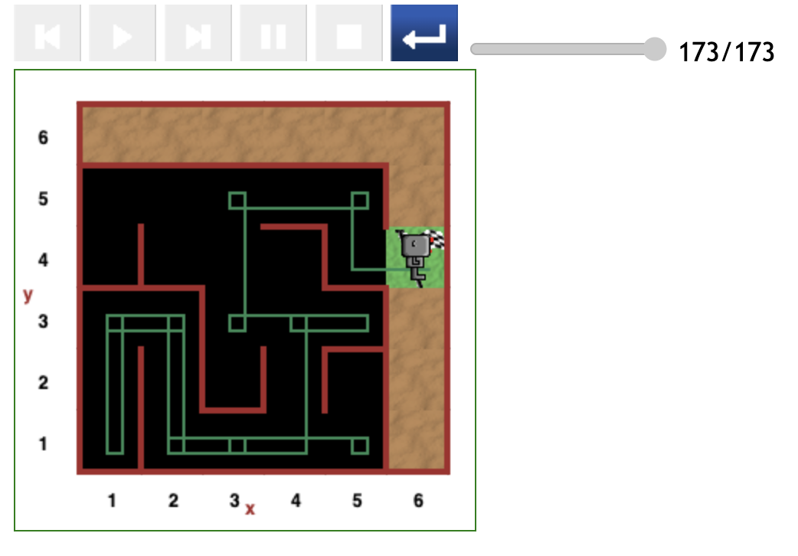

# Starting at (5,1) position in maze

The testing yielded one optimal path and the most expensive starting at the (5,1) grid position.

## Relatively direct path (83 steps)

Reeborg was the most efficient in the scenario depicted below:

- He turned right at the first possibility to do so, at the (4,1) position.
- Although he turned towards the (5,3) position, Reeborg performed a simple _turn around_ to move out of that alley.
- In addition, Reeborg traversed the more optimal subpath by moving straight to the (3,3) position from (4,3).
- The path cost a meer 83 steps of code to reach the destination.

## Indirect path (173 steps)

The scenario depicted below shows that Reeborg was initially facing downwards.

Since there was a wall in front, he turned to the right and moved to the (4,1) position.

[<< Previous starting point](<starting-at-(4,1)-position.md>)

\ \ -------- ... -------- / / [Next starting point >>](<starting-at-(5,2)-position.md>)
