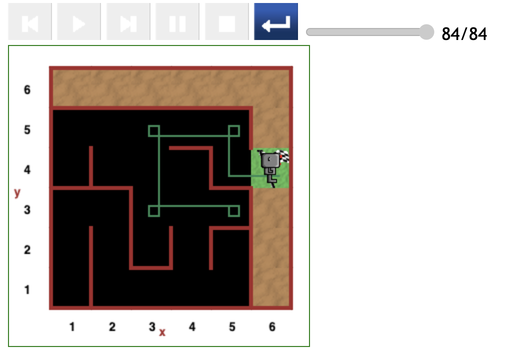
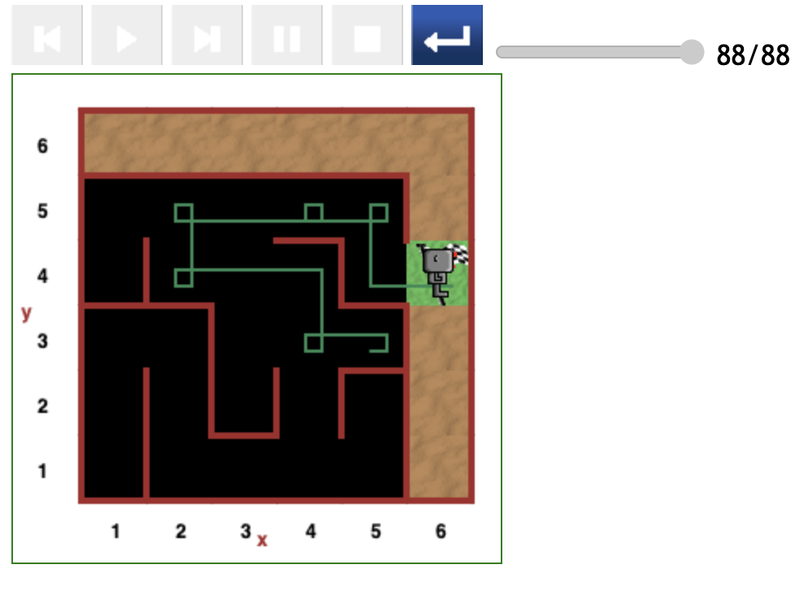

# Starting at (5,3) position in maze

As depicted in the figures below, all the paths followed by Reeborg in this round of testing are relatively direct.

This suggests that the code might be biased to make Reeborg succeed in this specific configuration of the maze.

[<< Previous starting point](<starting-at-(4,3)-position.md>)

\ \ -------- ... -------- / / [Next starting point >>](<starting-at-(3,3)-position.md>)
