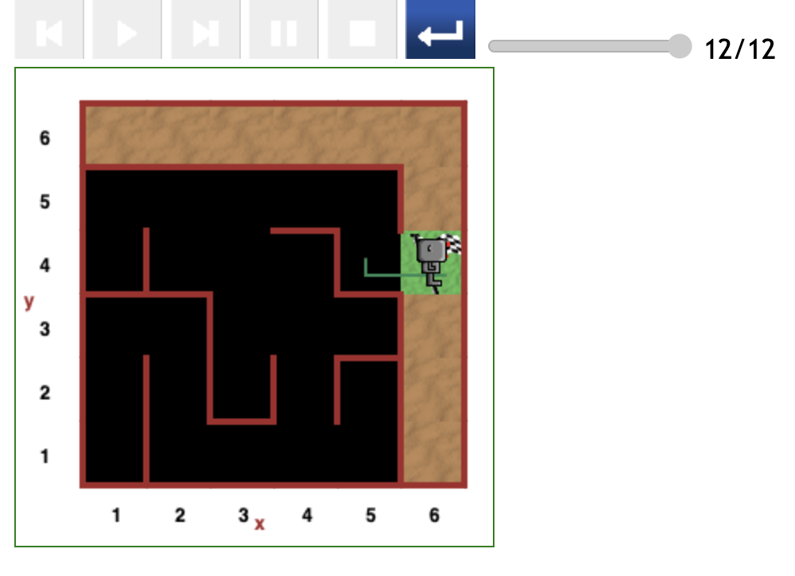
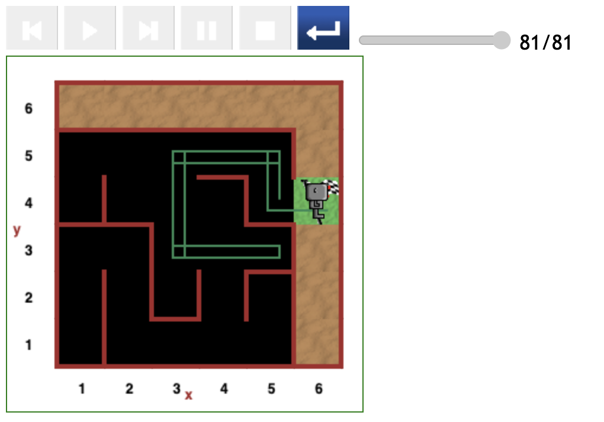
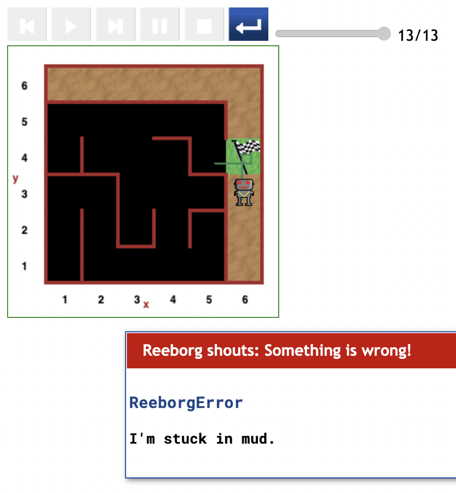

# Starting at (5,4) position in maze

The paths Reeborg followed starting from the (5,4) position follow the same pattern as those starting at the (5,5) position.

## Direct path (12 steps)

This most optimal path occurs when Reeborg initially faced downwards.

He simply turned left, moved forward and he was home and dry.

## Direct path (81 steps)

In this scenario Reeborg started off facing upwards.

He therefore moved forward to the (5,5) position, then turned left and moved forward to the (4,5) position. Reeborg then continued on a detour to the (5,3) position.

## Error in code

Although Reeborg always succeeds in exiting the maze, there is a bug that occurs when Reeborg starts off facing the exit.

This error is fully detailed in the [minor bug report](minor-bug-1-report.md).

---

[<< Previous starting point](<starting-at-(5,5)-position.md>) \ \ -------- ... -------- / / [Next >>](minor-bug-1-report.md)
