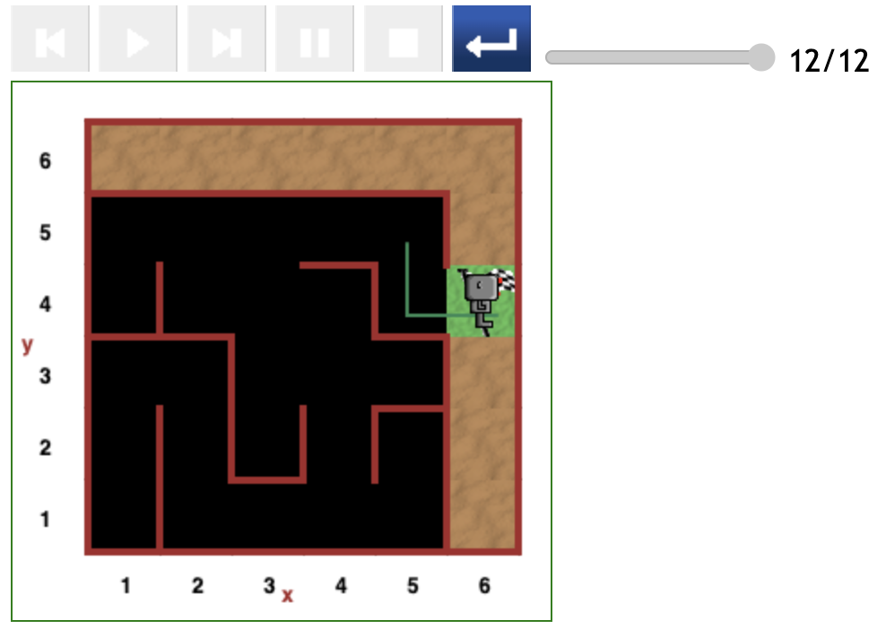
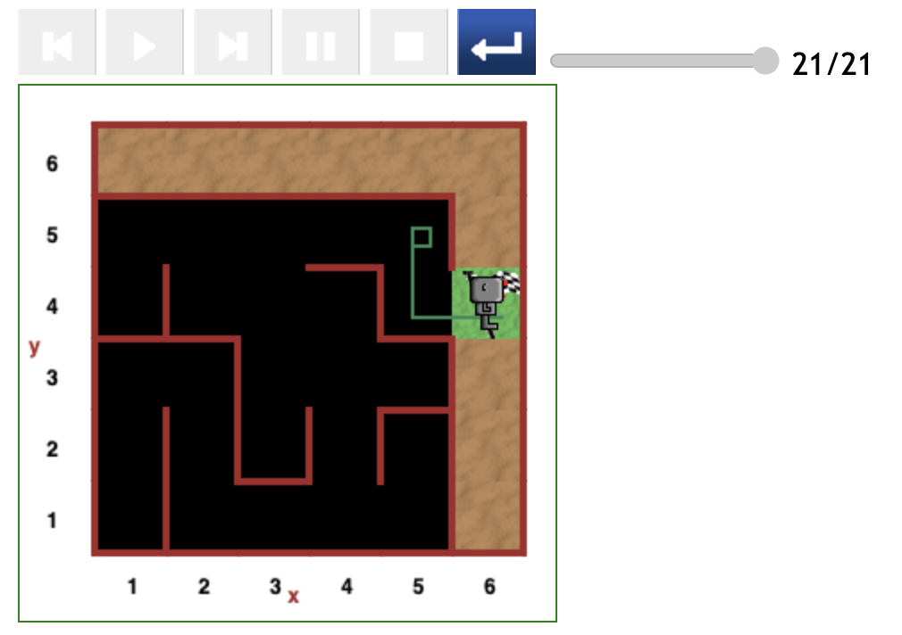

# Starting at (5,5) position in maze

There were only 3 paths yielded in this round of testing.

The produced is clearly determined by Reeborg's initial direction.

## Direct path (12 steps)

Reeborg was facing downwards from the beginning, he then moved forward to the (5,4) position.

At (5,4), with a wall in front and wall on the right, Reeborg turned left and moved forward to exit.

## Direct path (21 steps)

This time Reeborg was facing Right. So he performed a `turn_right()` and moved forward to the (5,4) position.

He subsequently turned left and took the exit.

## Indirect path (81 steps)

Reeborg started off facing upwards. Given the wall in front and the wall on the right at the (5,5) position, he turned left and moved to the (4,5) position.

A detour to the (5,3) position ensued.

-detour-81.png>)

---

[<< Previous starting point](<starting-at-(4,5)-position.md>) \ \ -------- ... -------- / / [Next starting point >>](<starting-at-(5,4)-position.md>)
